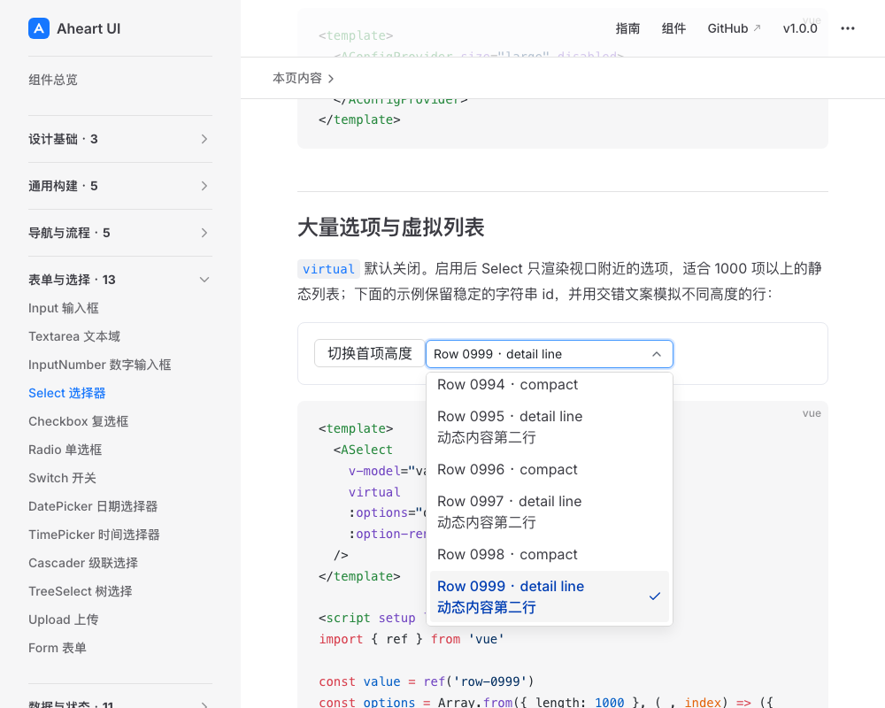
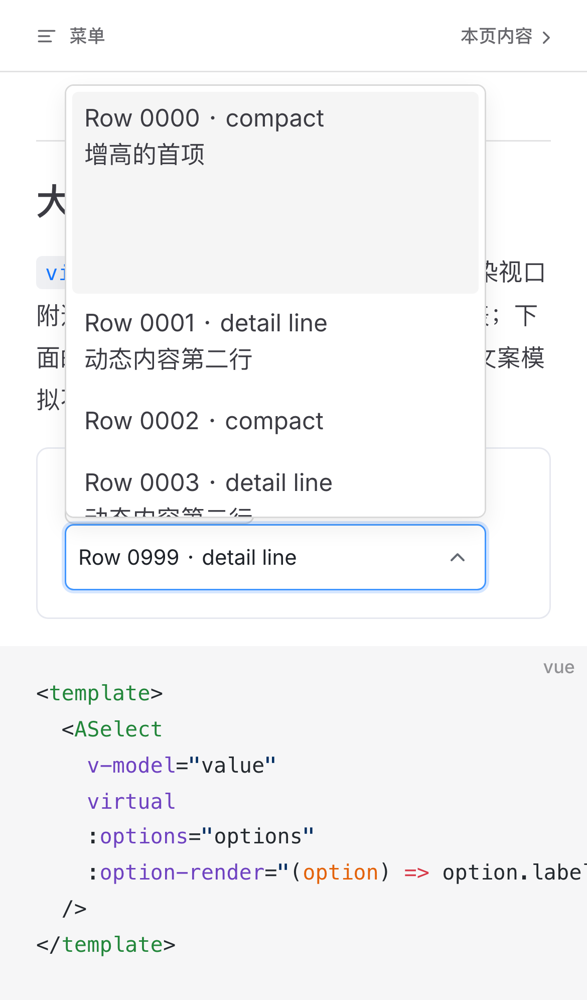
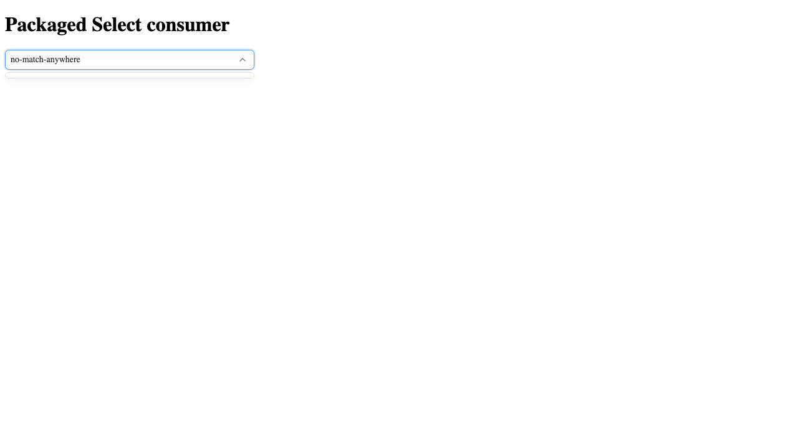

# D4 C Select 虚拟列表有限视觉审核

执行者：本任务整合者，使用product-design:audit进行新一轮截图核验；不是另一个独立设计代理。候选`84ad73a`，122文件指纹`56e5623a5d98ce69b9204b4c4bc5b93b415746aa8de42bd4c3c26dc0a8cb626b`。产品预览为当前候选构建后的Select文档页。

技能预检未发现保存的Product Design上下文；当前工具/本地技能目录未提供内置Browser入口，沿用本任务已授权的Playwright浏览器执行。没有改动用户现有浏览器页或使用旧截图。首张桌面截图因入场动画尚未完成而拒收，等待实际opacity=1和活动行位于viewport内后重新截图，再逐张打开本地图片验收。

## 1. 桌面打开已选尾项：本次视觉检查通过

目标：直接到达1000项列表的既有选中项，不让用户手动找尾部。

可见证据：Row 0999及第二行文案完整显示；选中勾标、蓝色文字与灰色活动背景区分明确；输入焦点边框清楚，浮层宽度与控件一致，圆角和边框沿用既有样式。本图不证明全部1000项可访问；窗口数量、ID和键盘定位属于测试证据。

## 2. 移动端增高首项与Home定位：本次视觉检查通过

目标：动态内容增高后仍显示完整文案，不被初始32px估算裁切。

先在关闭状态切换首项高度，打开后按Home。可见首项增高内容、多行第二项、完整控件焦点边框；浮层向上展开且横向不溢出屏幕。底部下一项部分显示是滚动窗口边界，不作为整行内容缺失。Home移动的是活动项，原已选值仍为Row 0999，这是导航与提交分离的既有Select行为，不从截图错误推断选中值已改。

## 结论与限制

本次两状态未见阻断任务的可见布局P1/P2。保留当前视觉风格，没有新造设计系统或扩到其他组件。截图不能判断完整WCAG、读屏、所有输入法或物理iOS行为；键盘/动态锚点/iframe清理以独立测试实际记录为准。首次启动、惯性滚动测量和重排均是交互门禁，不从静态图推断。

本报告只完成必要的局部视觉复核，最终产品裁定仍由产品经理作出。

## 追加：空搜索结果P2（需要修正后复验）

在真实packaged Select进一步搜索无匹配词后，发现popup仅约10px，内部empty行约54px被压住。此状态此前两张截图没有覆盖，不能据其推断空状态通过。

已补RED测试并修改空列表走自然内容高度，新增五浏览器空结果/恢复搜索用例。修正版必要视觉与独立测试结论将追加，旧图仍绑定初始56e候选，不改标成修正版证据。P2不能由仅两个正常状态的视觉检查抵消。
