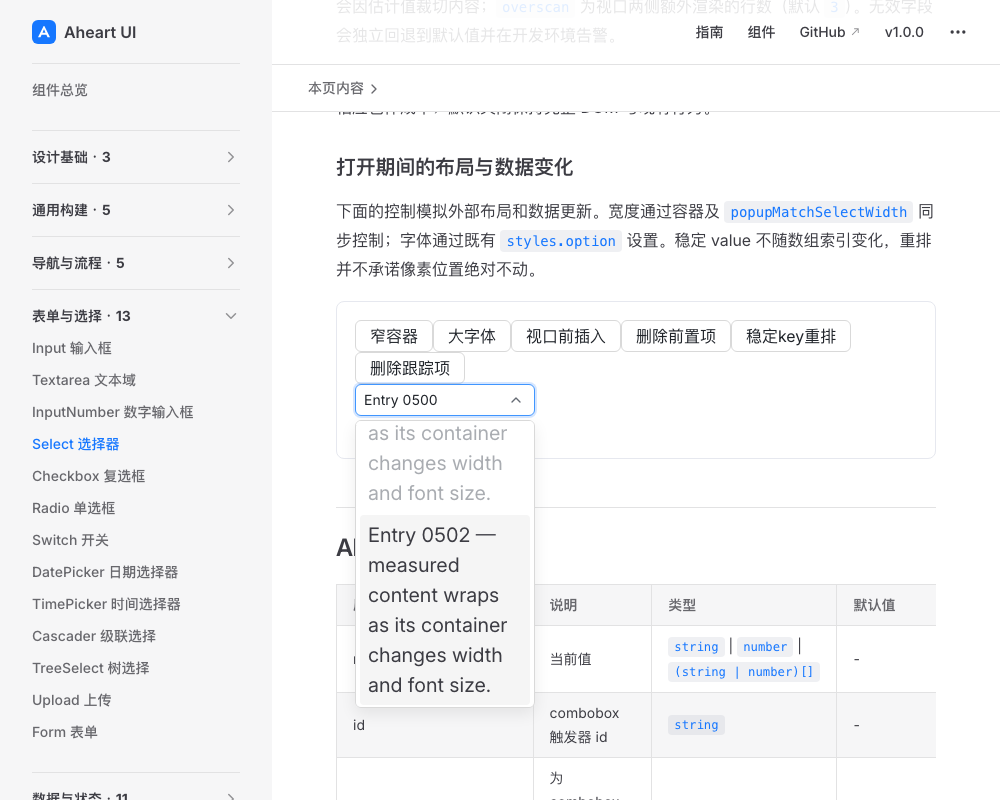
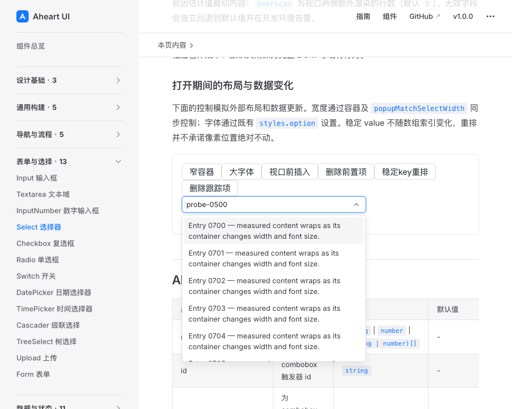

# 三项补证的必要视觉复核

候选`4e546e3`，指纹`a6e6597e4f471bc277a5c7b7b88acf7aa85e3c66559258ab547289673c5da664`。执行者为整合者，使用product-design:audit，不冒称独立设计代理。独立受影响测试完成后，直接使用其构建产物开启预览；不重建/改代码。按已有Playwright授权在新的1000×800桌面视口采集，每步先核对DOM目标并等待稳定可见状态，再保存、实际打开并验收截图。

## 1. 窄容器与大字体后键盘导航：通过有限视觉检查

实际将容器及公开popupMatchSelectWidth从360改为180，再把styles.option字体由14改为20。ArrowDown跳过disabled 0501后，0502的完整句子可读，行不重叠，焦点边框清楚。视口上沿的前一项只显示尾部属于正常滚动边界，不是当前active裁字。已选值仍0500、active为0502，是导航与提交分离，不从截图误判为值未更新。

## 2. 稳定key中部数据更新与删除active：通过有限视觉检查

在0500中部视口依次前插、删除前置项、重排，再删除0500，最终active为0700且完整可见。控件保留父层值probe-0500，是受控数据权威的表现，不擅自选择0700；身份和每步索引由E2E断言，而非静态图证明。没有承诺任意重排像素不动。

本次只复核runtime修复相关状态；tags呈现没有实现改动，创建/移除/clear/父拒绝由新增独立单测证明，不额外引入截图排列矩阵。未发现新增可见P1/P2；不追加PageUp/PageDown、所有hover、实体手机或读屏为门禁。技能影响限于本轮新截图、稳定状态检查及区分视觉和行为证据。
