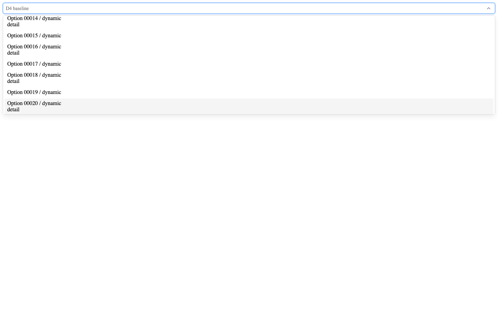

# Select 键盘滚动设计复核

整合者设计复核，执行于独立测试经理实际验证之后。候选commit `709de18a183a09e76059c6ea184232b8f41163f4`，指纹`17de1fad1c17fdbcd9ff686812de6067316b626e93a35c5b506d6a24e1a285ad`。

范围：本次键盘活动项滚动跟随与多行内容可见性；无颜色、字型、布局、公开API变化，不重做完整文档站设计审核。

复核动作：使用view_image打开以下真实Chromium截图，查看与基线同尺寸/状态的活动项；同时核对baseline JSON的活动文本和popup边界，不以截图推断键盘次数或无障碍完整合规。

1. 固定行高：20次ArrowDown后Option00020处于浮层底部且完整可见，高亮边界清晰，触发器未被滚出页面。健康。
   
2. 动态行高：交错32/46px内容，Option00020及其detail行完整可见，没有按32px固定步长裁掉末行。健康。
   

修复前`select-fixed-keyboard-1788752455589.png`仍停在最初选项，活动项已在视口外；仅修滚动的中间版本停到Option00040，重复keydown已在最终候选修正。最终上述两图来自独立测试经理运行，不使用中间版本作为通过证据。

未覆盖：该performance harness为默认浏览器继承字体、开发模式、桌面1440×900、reduced-motion；不是最终生产文档站整体视觉承诺。浏览器键盘/iframe自动化另见测试报告，实体辅助技术和窗口化尚未验收。

本次可见范围未发现新增设计P1/P2。两项内部缺陷的产品关闭与整个D4是否放行仍由产品经理决定。
