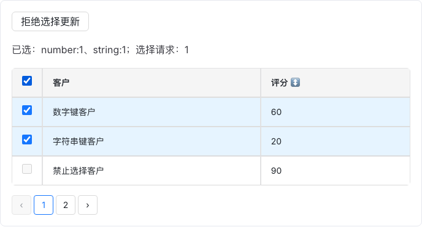
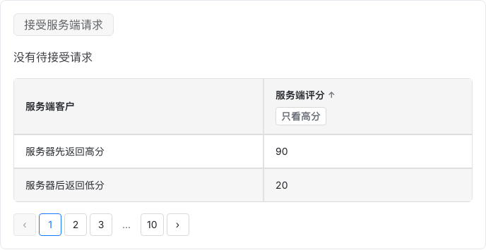
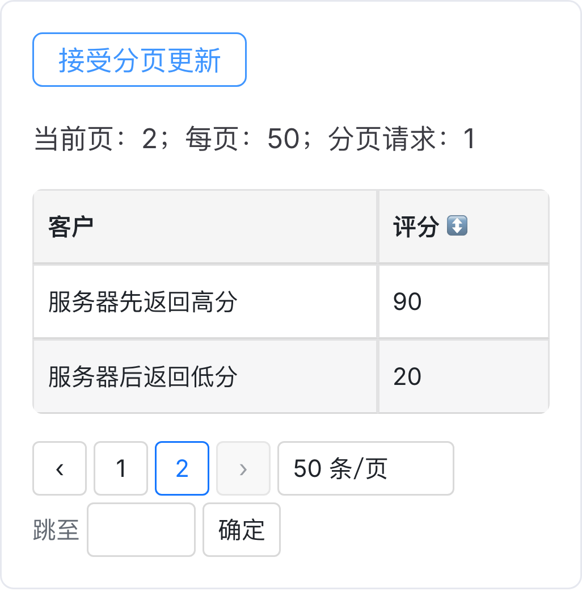

# D5-A 必要运行时视觉复核

范围：已批准A的全选/禁用、服务端请求与移动分页。主线程使用Product Design audit流程，读取现有设计系统并捕获本轮运行时图，不作为独立设计师报告。没有新的品牌资源、全局样式或D5-B/C布局变更。

## 场景1：当前页全选与禁用行 — 通过

1440×1000视口；区域宽度/scrollWidth均686。已选蓝底、原生勾选与禁用行有明确区分；数字与字符串key的选择结果在状态文本中分别显示，分页和状态无重叠。全选/跨页/父拒绝行为由五浏览器断言补充，不仅凭截图。

## 场景2：接受服务端查询，响应顺序不被本地篡改 — 通过

1440×1000视口；区域宽度/scrollWidth均686。查询接受按钮和状态明确，列排序状态与当前响应数据分开；夹具故意保留服务器先返回高分的数组，证明组件不擅自本地重排，不声称已请求真实服务器。当前内联筛选按钮沿用旧设计，筛选浮层仍属B。

## 场景3：移动端接受页大小，页码合法回退 — 通过

390px移动视口；区域宽度/scrollWidth均340，截图为设备像素比例3。页码、页大小和快速跳转自然换行，文案未裁切、未出现区域横向溢出。父层接受后的第2页/50条与界面一致。

## 限制和交付边界

截图为本轮Playwright Chromium真实渲染，逐张打开检查；Firefox/桌面与移动WebKit的交互以自动化结果为准。没有实体手机、读屏或完整WCAG认证结论。已有原生选择框的触摸目标大小、辅助技术下的完整朗读仍不能仅由这些图证明；不新增为本批未约定门禁。用户最终产品验收待确认。

独立完整门禁通过后，已在最终`b94252b`文档构建上重新捕获并逐张打开检查这三张截图；无裁切、重叠或区域横向溢出，最终DOM/几何日志与图片同目录保留。该报告不把可见范围之外的固定列、错误态或虚拟滚动评为通过。
