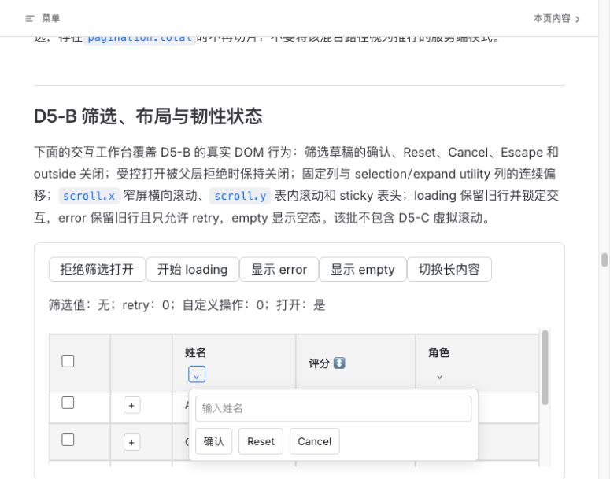
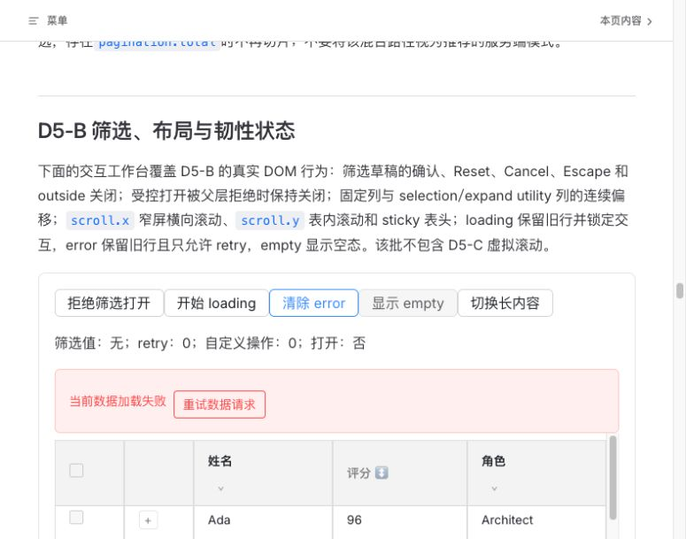
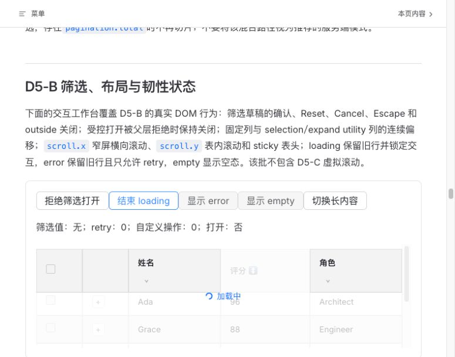
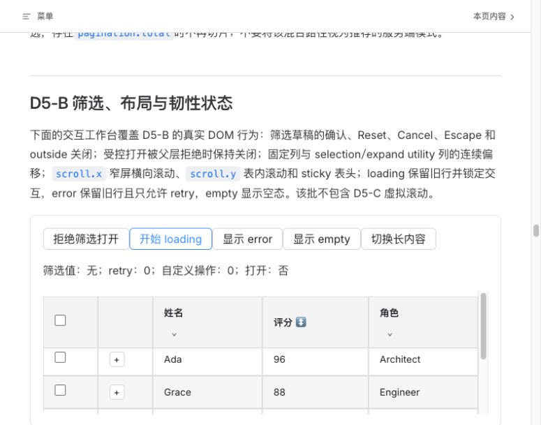

# D5-B 运行时视觉审查

范围：D5-B 筛选、布局与韧性状态的最终运行时视觉证据。主线程使用 `product-design:audit` 流程与 Codex in-app browser，在全新 `5210` 最终 build 上捕获并逐张 `view_image` 检查本轮截图；这不是独立设计代理报告，也不替代开发、测试或产品验收门禁。

候选 HEAD：`8f70387996a170ce31bdbcc5a24c6c2fc2011474`

生产基线：`c7dd91a5ebdfbd31d10b7cbfce1878e1e49fba4b`

## 视觉证据

### 场景 1：筛选浮层打开 — 通过

页面位于 D5-B 交互工作台，筛选触发器与浮层输入框、确认、Reset、Cancel 按钮均在同一可见区域内；表头和数据行没有被浮层错误覆盖，按钮间距可辨识。截图未见 P0/P1/P2 级视觉问题。

### 场景 2：error 保留旧数据 — 通过

错误提示以浅红色区域呈现，`重试数据请求` 是明确的恢复动作；下方原有 Ada 等数据行仍可见，错误层没有遮住或替代旧数据。截图未见 P0/P1/P2 级视觉问题。

### 场景 3：loading 保留旧数据 — 通过

表格保留旧数据并以半透明遮罩和“加载中”指示当前请求，状态层级清晰，未出现空白跳变或错误提示与 loading 叠加。截图未见 P0/P1/P2 级视觉问题。

### 场景 4：固定布局 — 通过

表格列边界、selection/utility 区域和滚动条在当前视口内保持稳定；列标题、数据文本及交互控件未见错位、裁切或横向重叠。截图未见 P0/P1/P2 级视觉问题。

## 发现与修复历史

- 深页筛选打开曾导致 `scrollY≈8917→0`，属于 P1（`a4d8728` RED）；`7791aec` 修复并保留文档滚动位置。
- 筛选 input label/buttons spacing 与 opaque error overlay hiding stale rows 曾暴露为视觉/可用性缺口（`e24e706` RED）；`ab937cb` 修复旧数据保留，`3e9805c` 纠正测试以检查 stale row visibility 而非 inert hit testing。
- 后续筛选 Teleport lock/name/timing 行为已修复至生产基线 `c7dd91a`；候选测试 `8f70387` 使用安全的 outside target 覆盖移动竞态。

## 结论与限制

本轮四张最终截图的可见 P0/P1/P2 均为 0。它们支持当前运行时的布局、筛选浮层、error/loading stale-data 呈现结论，但静态图不替代键盘焦点循环与 Escape/outside 行为、iframe owner realm、受控状态拒绝、loading/error 锁定矩阵及跨浏览器自动化证据。该设计审查不单独放行产品、PR、合并或发布；产品验收与其余门禁仍以各自证据为准。
