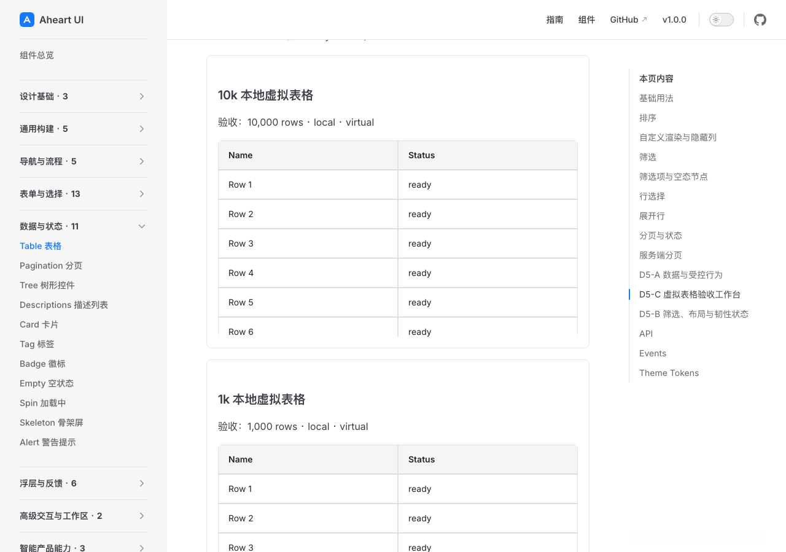
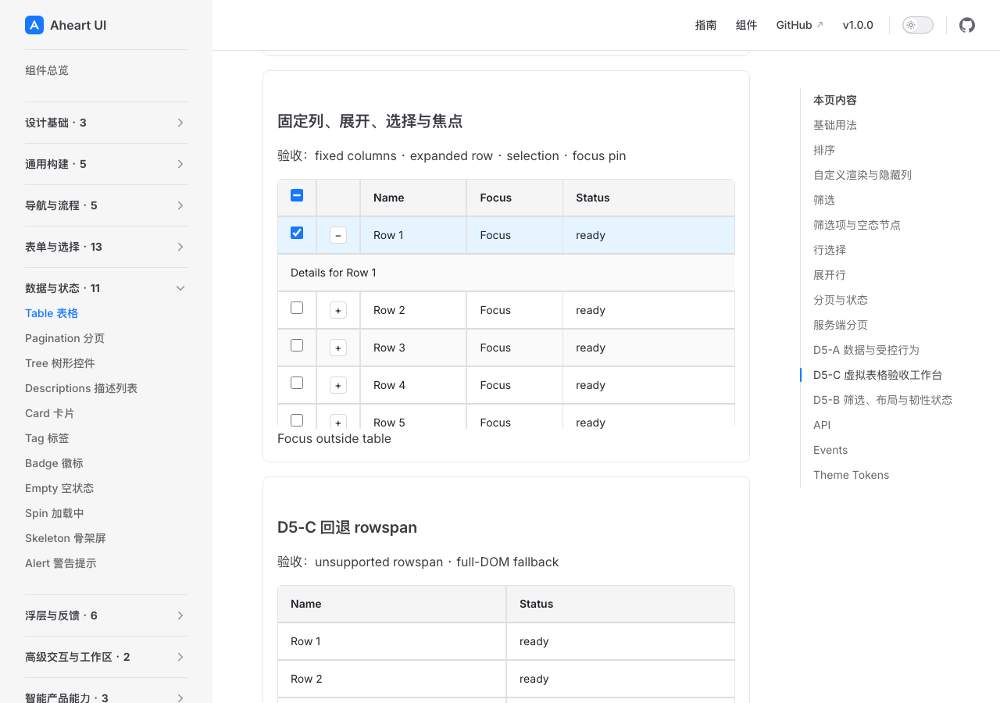
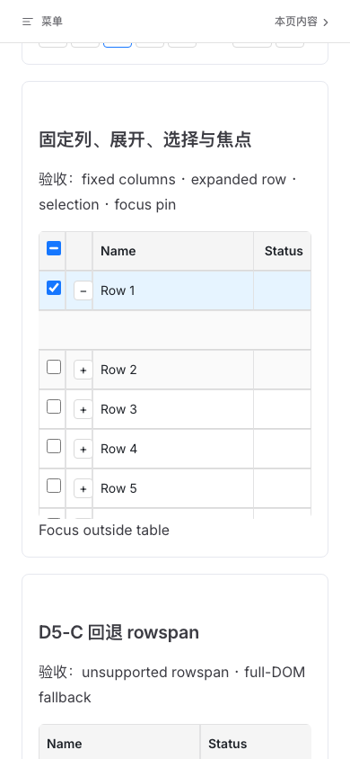
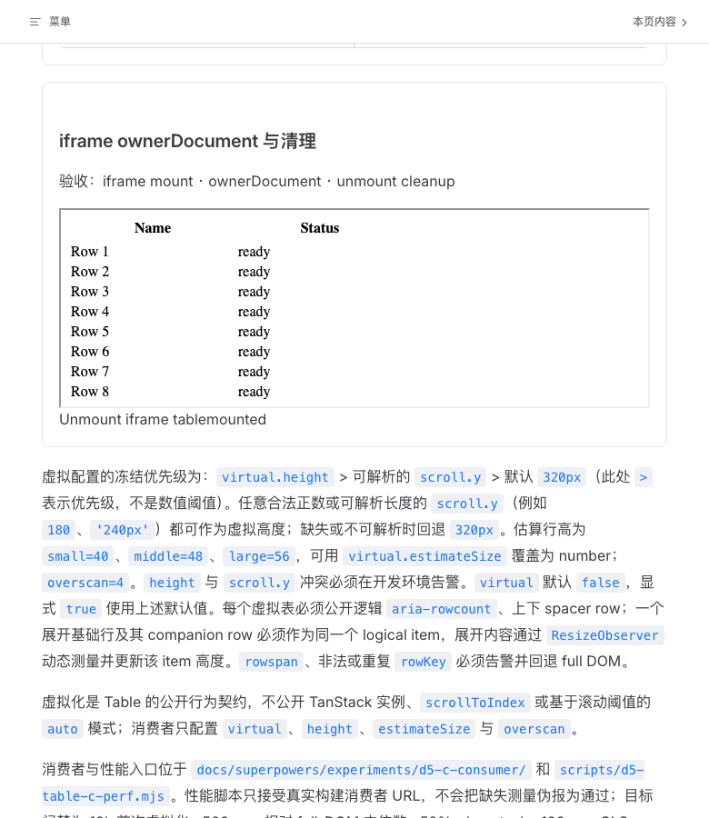
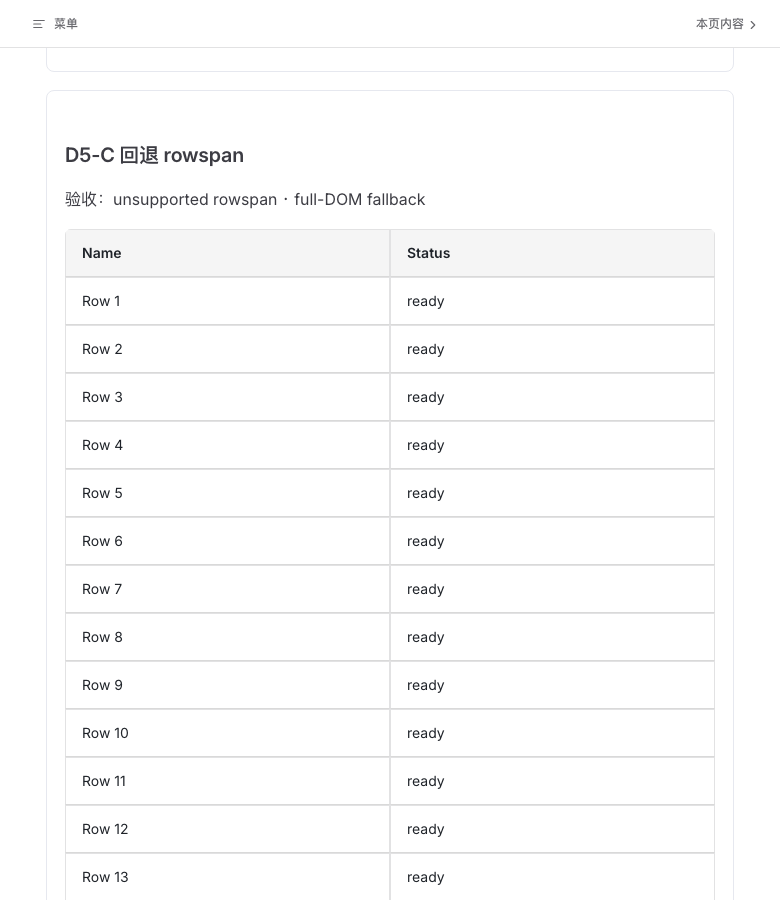

# D5-C 运行时视觉审查

范围：D5-C 虚拟化、固定列、展开/选择/焦点、iframe ownerDocument 与不支持 rowSpan 的 fallback 最终运行时视觉证据。主线程按 `product-design:audit` 流程使用 Codex in-app browser/Playwright 进行审查，并对本轮五张证据图逐张 `view_image` 检查；这不是独立设计代理报告，也不替代开发、测试、性能或产品验收门禁。

候选 HEAD：`16f663bb7931e658b121af396e38e20e4b726015`

## 视觉证据

### 场景 1：10k 本地虚拟表格 — 通过

工作台展示 `10,000 rows · local · virtual`，表头、数据行和滚动区域清楚可见；虚拟表格在页面中保持正常卡片边界与可读的列标题/状态文本。截图未见 P0/P1/P2 级视觉问题。

### 场景 2：固定列、展开、选择与焦点 — 通过

固定列场景同时呈现展开行、已选择行与 `Focus` 焦点标记；选中行的浅蓝背景、展开详情行和固定列边界均保持可辨识，表格外的 `Focus outside table` 也可见。截图未见 P0/P1/P2 级视觉问题。

### 场景 3：移动端固定列 — 通过

390px 移动视口下，菜单栏、场景标题、选择/展开控件、`Name`/`Status` 表头与行内容均在可见区域内；`Status` 列完整呈现，没有透明透底或裁切。截图未见 P0/P1/P2 级视觉问题。

### 场景 4：iframe ownerDocument 与清理 — 通过

iframe 场景明确显示 `iframe ownerDocument 与清理`，表格内容正常挂载，底部可见 `Unmount iframe tablemounted` 状态；页面下方的虚拟配置说明也保持排版完整。截图未见 P0/P1/P2 级视觉问题。

### 场景 5：rowSpan fallback — 通过

`D5-C 回退 rowspan` 场景标明 `unsupported rowspan · full-DOM fallback`，普通表格逐行展示 `Row 1` 至 `Row 13`，列标题和边界稳定可读。截图未见 P0/P1/P2 级视觉问题。

## 发现与修复历史

- 历史 final 文档曾使用 RED 状态，且工作台面板缺少可见标签；`e838843` 完成文档/工作台收口。
- 移动 fixed 列曾出现透明透底与 `Status` 裁切（`38931f3` RED）；`507f4e8` 增加窄视口可读性与 `reserve64` 处理，最终移动截图中的 `Status` 完整且无透底。
- expanded 行背景曾被基础 opaque 层覆盖（`cf70727` RED）；`3737849` 恢复 expanded cell 背景，`1e0f93e` 修正测试以允许可选 hover 背景 token。
- CLS 调试曾定位到 spacer row 引发的视觉位移（`9593143` 证据，历史 CLS `0.3531`）；`d1d672e` 排除虚拟 spacer 的视觉位移，最终五轮结果为 `CLS 0.0014698361`，低于 `0.1` 门槛。

## 结论与限制

本轮五张最终截图的可见设计问题为：P0 = 0，P1 = 0，P2 = 0。图像支持当前运行时的 10k 虚拟化呈现、fixed/expanded/selection/focus 组合、移动端 fixed 可读性、iframe ownerDocument 挂载/卸载，以及不支持 rowSpan 时 full-DOM fallback 的视觉结论。

静态图不替代键盘焦点循环、Escape/outside 行为、SSR/hydration、跨浏览器自动化、真实性能门禁、ARIA/辅助技术和消费者包验证；这些结论仍以各自的 Playwright、SSR、性能与 consumer 证据为准。本设计审查不单独放行产品、PR、合并或发布。
