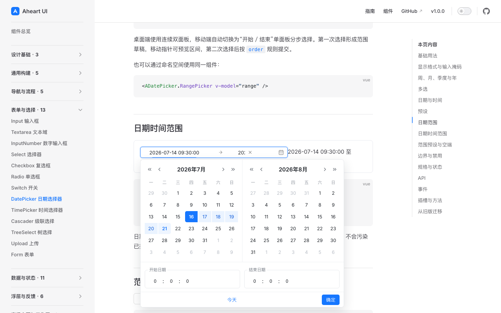
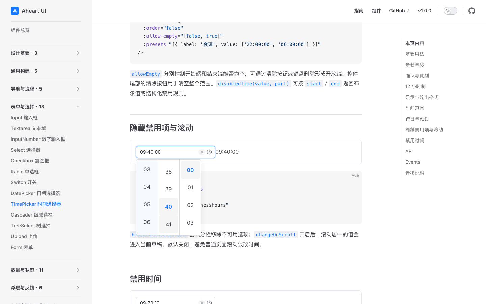
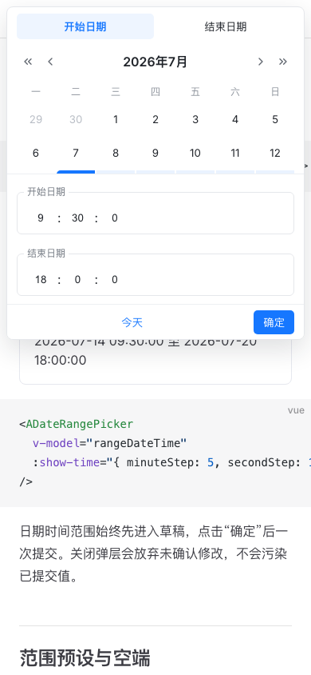
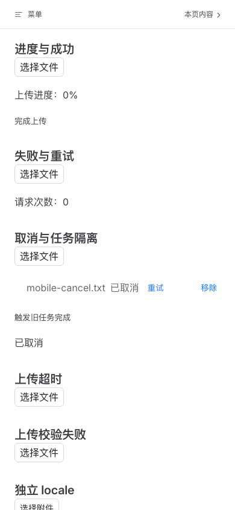

# D6 Picker / Upload screenshot-first design audit

范围：D6 Picker transaction、真实时间列几何、深页面 DateRange showTime 浮层、Upload cancel/retry/timeout/validation 与移动端状态。捕获工具为 Playwright production preview；全部图片来自本轮最终 `5292` 构建并逐张打开检查。审查目标是主任务可读、操作可达、状态可辨与移动端重排；截图不替代键盘、读屏、SSR、cleanup 或跨浏览器自动化。

## Overall verdict

最终截图未发现 P0/P1/P2。此前审查发现的 Upload 移动操作目标过小与错误文字对比度偏低两个 P2 已修复并重新捕获；此前浏览器测试发现的 DateRange footer 裁切与 placement 振荡属于真实 P1，最终截图确认 footer 可达且浮层完整落在 viewport 内。

## Steps

### 1. Deep-page DateRange draft — healthy

双月日历、开始/结束时间、范围高亮、Today 与 Confirm 层级清楚；panel 位于页面可视区内，sticky footer 完整可点击。截图支持可达性与布局结论，不单独证明 Escape/focus restore。

### 2. Live time-column geometry — healthy

52px 自定义行高下，分钟 `40` 保持居中高亮，输入值同步显示 `09:40:00`；三列边界与选中态清楚，没有依赖旧 28px 视觉假设。

### 3. Upload cancelled/retry state — healthy

文件名、`已取消`、Retry 与 Remove 在同一行保持清晰顺序；状态与恢复入口同时可见。

### 4. Upload timeout — healthy

超时使用明确文字而非只依赖颜色，并保留 Retry/Remove。错误色经自适应加深后与普通状态有足够可辨差异。

### 5. Upload validation failure — healthy

校验失败与传输失败/超时使用不同文案，用户能判断失败发生阶段并直接重试。

### 6. Mobile DateRange showTime — healthy

390px 下切换为单面板分步选择；日期、两端时间、Today 和 Confirm 全部在视口内，没有底部裁切或横向溢出。

### 7. Mobile Upload lifecycle — healthy

取消状态、Retry 与 Remove 在窄屏仍保持独立；透明文字操作的实际 block target 已提升到至少 40px，页面没有横向裁切。截图不能证明触屏误触率，真实移动 WebKit 自动化另行覆盖。

## Accessibility limits

- 截图确认可见标签、状态文字、布局与操作目标，没有声称完整 WCAG 合规。
- 键盘确认/Escape、焦点恢复、动态状态宣布、ownerDocument、reduced motion、SSR/hydration 和卸载清理由 unit/E2E/consumer 证据负责。
- 本轮不包含物理 iOS Safari；该项仍属于 D9 发布门禁，不能用 mobile WebKit 代替。
