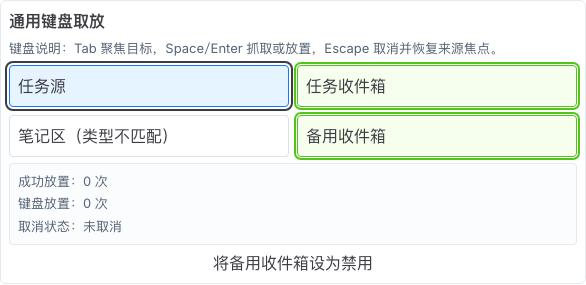
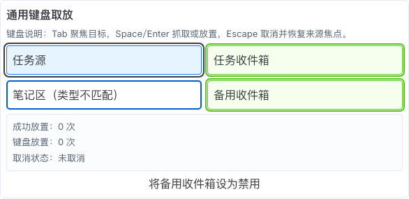
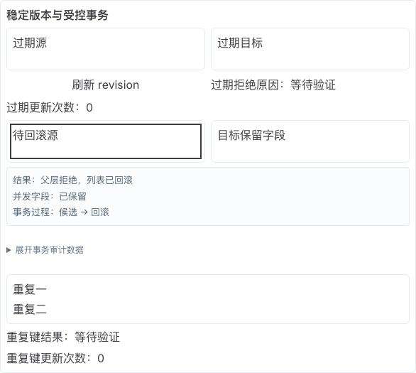
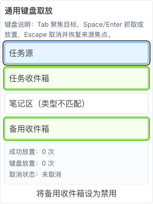
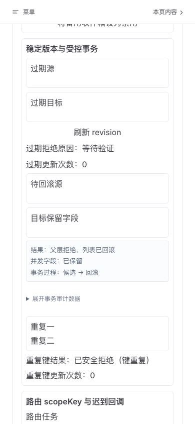
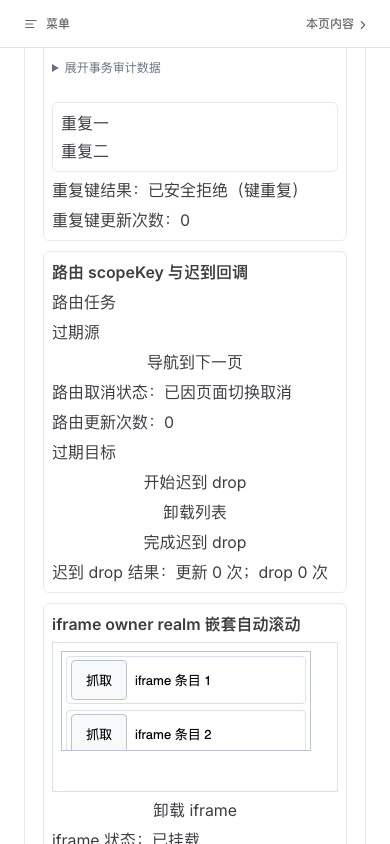
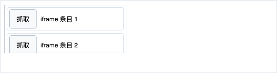

# D7 DnD screenshot-first design audit

范围：D7 通用键盘取放、兼容/不兼容目标、受控回滚、重复键、scopeKey、移动端重排与 iframe owner realm。审查使用最终 production preview；7 张 final 图片均由本轮重新捕获并逐张打开检查，`manifest.json` 的 runtime errors 为空。截图不替代键盘、读屏、事务、SSR、iframe cleanup 或跨浏览器自动化。

## Overall verdict

最终可见 P0/P1/P2=`0/0/0`。首轮截图发现并关闭：受控回滚把完整 transaction JSON 与裸计数铺在中文页面的 P1；“禁用收件箱”初始实际可用、DragOverlay 只显示 `task`、generic/route 取消状态串扰、`duplicate-key` 机器码直出的 P2；移动端长 locator 截图被 sticky 页头横切，已废弃并拆成两个真实 viewport 截图。

## Steps

### 1. Desktop keyboard grab and compatible targets — healthy

来源使用蓝色抓取态，兼容目标使用绿色边界；键盘说明、成功次数和取消状态有明确标签。Overlay 显示业务名“任务源”，不再显示裸类型 `task`。

### 2. Desktop incompatible target — healthy

不兼容目标保留可聚焦边界并直接写明“类型不匹配”；成功目标仍可区分。截图只能证明可见提示，零 drop 与 live announcement 由 E2E 负责。

### 3. Controlled parent rejection and rollback — healthy

主结果改为“父层拒绝，列表已回滚”，并明确并发字段保留与“候选 → 回滚”过程；稳定 transactionId/sessionId/JSON 收入默认折叠的审计详情，不再压过用户任务。

### 4. Mobile keyboard grab — healthy

390px 下四个 source/target 纵向重排，说明与状态未横向裁切，抓取态和兼容目标仍可辨。

### 5. Mobile rollback and duplicate-key result — healthy

回滚摘要、折叠审计详情和重复键结果按单列阅读；机器码改为可读“已安全拒绝（键重复）”，原 code 仅保留给测试/审计。

### 6. Mobile scope and iframe region — healthy

路由取消、迟到 drop 与 iframe 状态有独立标签；generic Escape 不再污染 route 状态。该图使用真实 viewport capture，固定页头只在顶部，不再横切内容。

### 7. Iframe owner-realm scroll surface — healthy

iframe 条目去除默认 bullet，抓取按钮与行边界清楚；桌面最小 36px，coarse/mobile 至少 40px。可见截图不单独证明 nested handoff 或 detach cleanup，相关结果来自五浏览器 E2E 与 consumer。

## Accessibility limits

- 截图支持可见说明、焦点/抓取/目标状态、信息层级、移动端 reflow 和目标尺寸结论，不声称完整 WCAG 合规。
- Space/Enter/Escape、Tab/Shift+Tab、Alt+Arrow、焦点恢复、失败 live region、重复 announcement、ownerDocument、SSR/hydration 和 cleanup 由 unit/E2E/consumer 证据负责。
- mobile WebKit 不等于物理 iOS Safari；物理设备仍属于 D9，不能以本报告替代。

