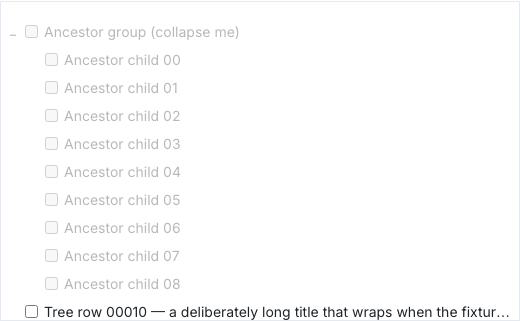
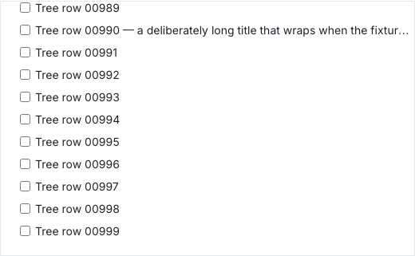
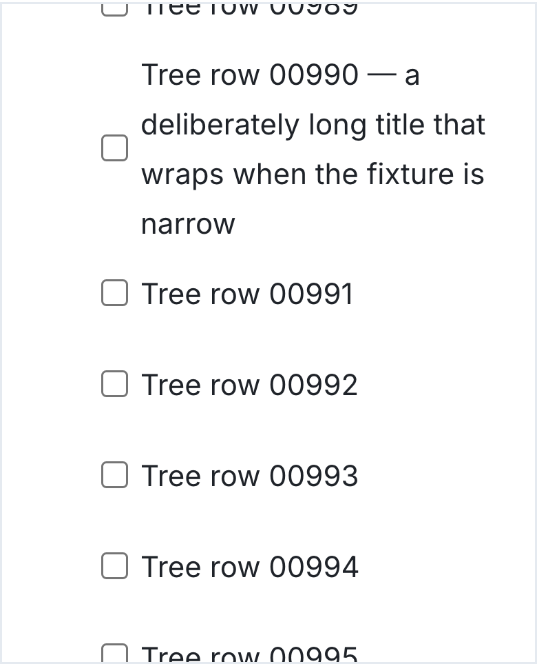
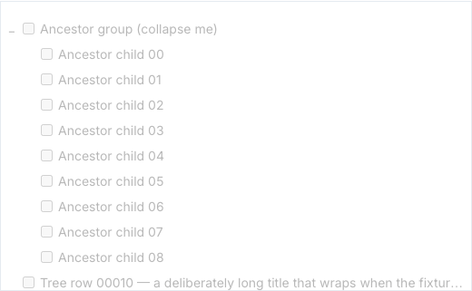
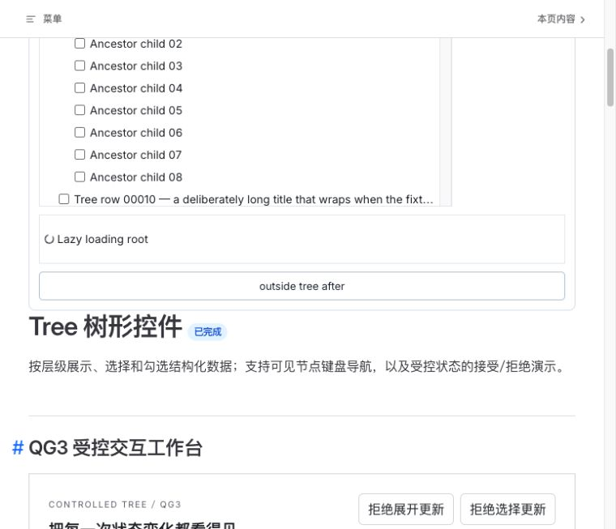
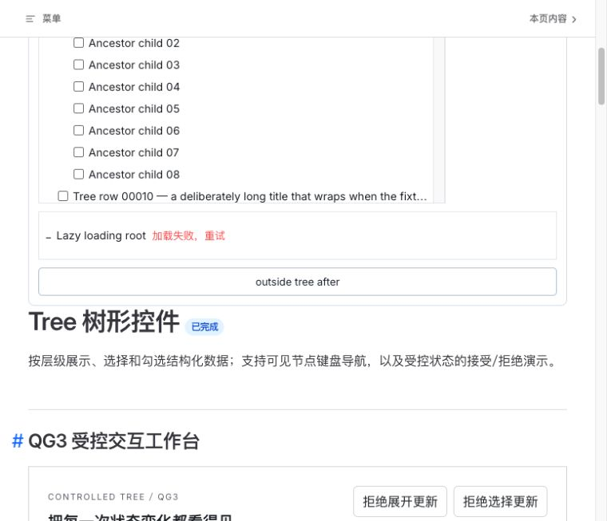
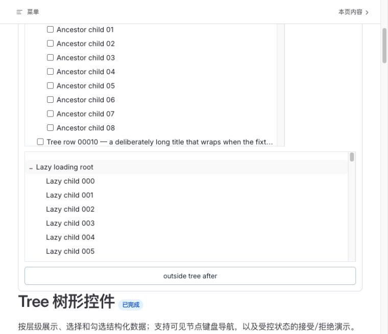

# Tree virtual runtime design review

Scope: the current Tree substage, using the Product Design audit screenshot-first workflow. Sources are the live source preview on port 5371, the current Tree styles and the independently captured `r12` screenshots below. This is not a design review of TreeSelect or Cascader.

Initial live browser inspection identified missing hierarchy indentation and rejected the candidate. After repair, fresh captures were opened and inspected. An earlier mobile capture was rejected because the documentation header obscured the fixture and the multiline title was not fully shown.

1. **Parent/child hierarchy and inherited disabled state — pass.** Child rows retain the 20px visual level distinction. Disabled controls and text are consistently subdued, while the following independent root remains available. The screenshot is supported by DOM/behavior regressions for inherited disabled state.

2. **Desktop scroll tail — pass.** The last logical item is visible, adjacent rows do not overlap and the final viewport contains continuous content.

3. **Mobile narrow, larger-font multiline title — pass.** The freshly captured viewport displays the complete four-line title and the following rows with no overlap. Cropping of the preceding/following row at the scroll viewport edge is expected; the audited multiline row is fully visible.

4. **Whole-tree disabled presentation — pass.** All shown rows consistently indicate the disabled state. Independent five-browser tests verify that this state still permits reading by scrolling and that re-enabling restores keyboard navigation.

Tree visual verdict for these states: P0/P1/P2=`0/0/0`. Keyboard, selection, ARIA metadata and cleanup are supported by independent tests rather than inferred from screenshots. Physical devices, screen readers, performance, release consumers, broader TreeSelect/Cascader layouts and the complete phase's final screenshot matrix remain outside this substage review.

## Product-requested lazy flow supplement

The main reviewer used the Codex in-app browser against the source preview at port 5371 after the ownerDocument focus-history repair was frozen. All three saved PNGs were opened and inspected individually. An intermediate error capture showing only fixture controls was rejected and recaptured with the lazy row fully visible. These images replace earlier pre-repair lazy captures; they do not replace steps 1–4 or the final combined phase's visual gate.

5. **Pending lazy load — visually healthy.** The root label remains readable with an adjacent progress indicator; the small tree is not stretched to its maximum virtual height. This intentional loading state is the audit target, not an incompletely loaded page.

6. **Failed load and retry entry — visually healthy.** The original root remains in place and an adjacent text action explicitly says loading failed and offers retry; failure is not communicated by color alone. The complete row is visible below the documentation header.

7. **Keyboard retry success — visually healthy.** Enter on the retry button restores child content in a bounded scroll viewport. Indentation distinguishes children from the root, with no overlap or blank content gap in the captured area. A read-only DOM check after success confirmed the actual focused element was the root `treeitem`; asynchronous cancellation behavior must still pass independent diagnostics rather than being inferred from this picture.

Supplemental visual verdict: P0/P1/P2=`0/0/0` for these three observed states. This is source-preview evidence at the in-app viewport, not a physical-device, contrast-ratio, screen-reader, packed-consumer or deployment claim. Independent product re-review remains required.
