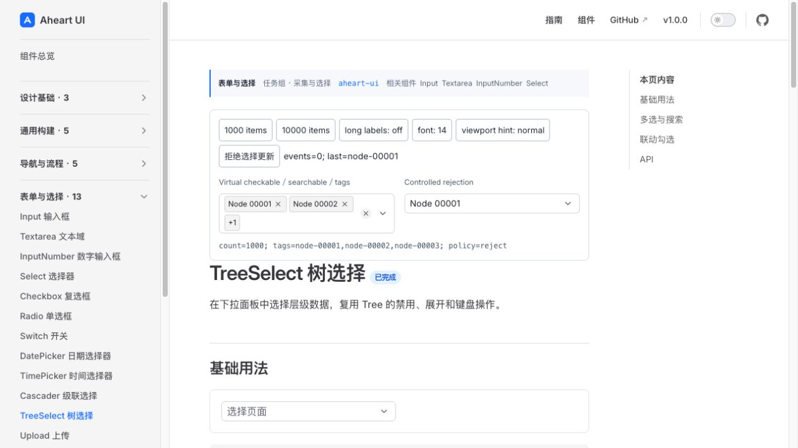
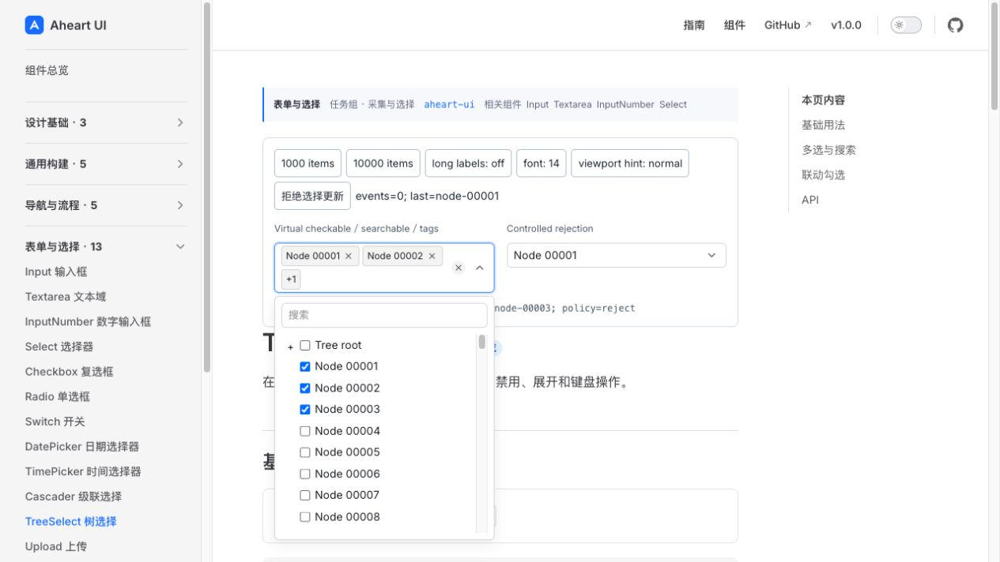
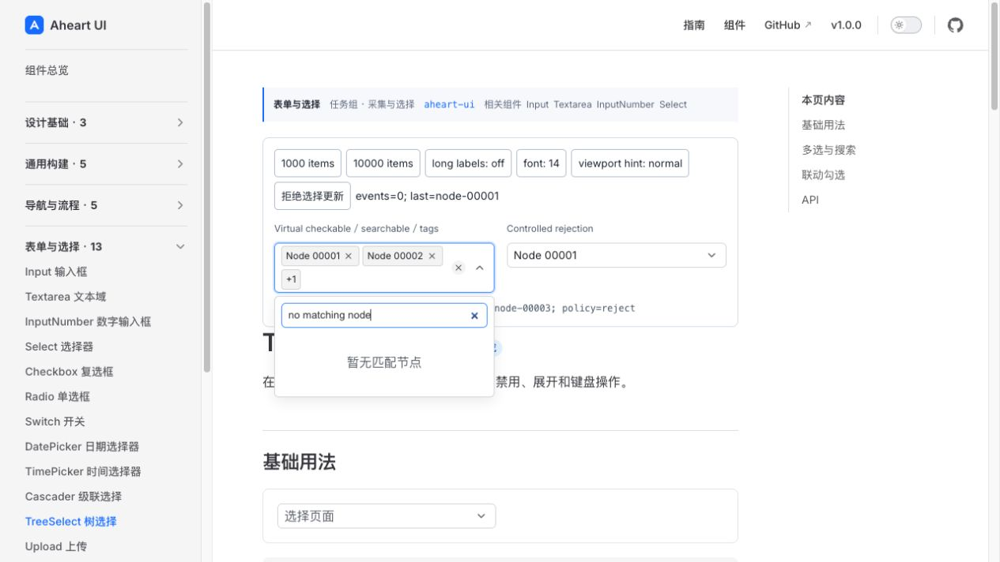
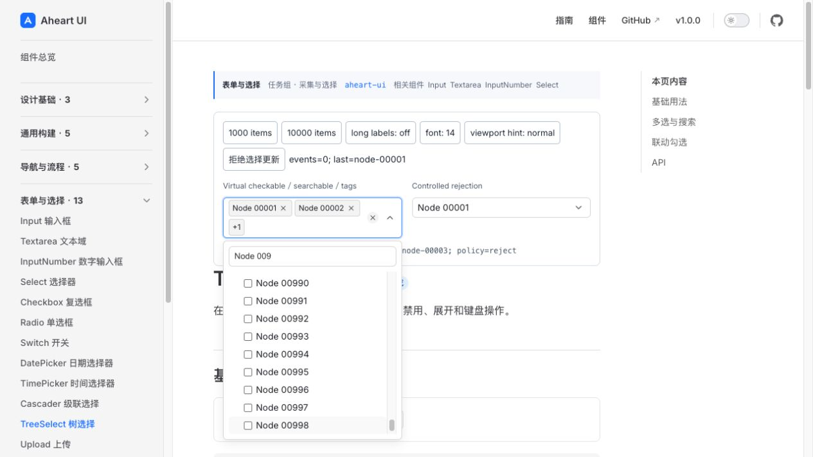
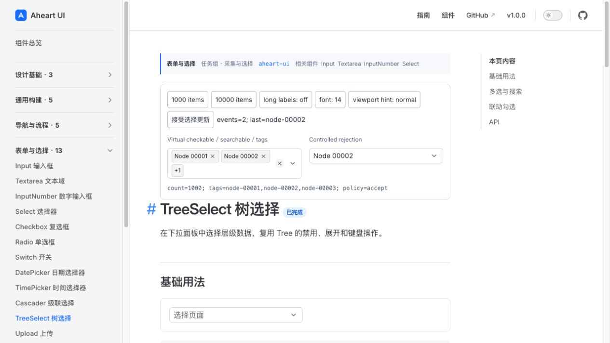
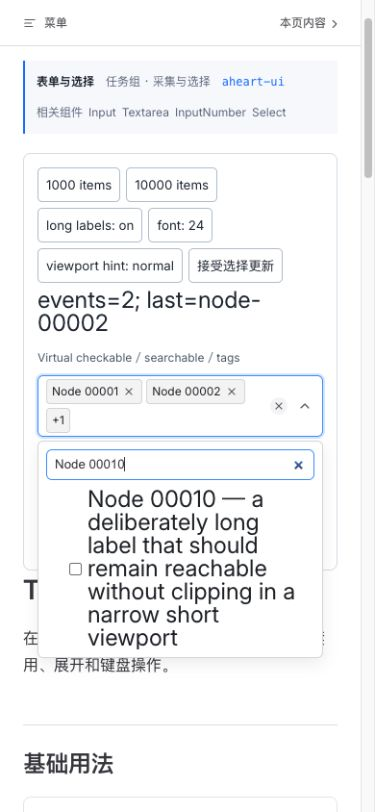

# TreeSelect virtual screenshot-first design review

Scope: TreeSelect source candidate `effc110`, normal and narrow source-preview interactions. Product Design audit was used to capture the actual flow first, save each PNG and reopen every saved image. The existing component design system was retained. This is not the three-component final visual/consumer/deployment gate.

1. **Closed selected tags — healthy.** Two explicit tags and a `+1` overflow count represent the three accepted selections. Labels identify the two independent fields and the trigger retains a clear affordance.

2. **Open searchable tree — healthy.** The search field stays above the tree viewport. Checked nodes correspond to accepted values; the root expansion affordance remains distinct. The independent browser suite verifies one actual vertical scroll owner rather than inferring that solely from the picture.

3. **Search with no matches — healthy.** The query stays editable, an explicit empty-result message appears, and the accepted tags remain unchanged. This is an intentional no-result state, not an unloaded page.

4. **Keyboard search tail — healthy.** ArrowDown entered the results and End moved actual DOM focus to the last enabled result, Node00998. The visible viewport is filled and that focused row is fully shown. The disabled final node is not fully visible in this image; its disabled/non-focus behavior comes from DOM and browser assertions, not this picture.

5. **Rejected controlled selection — healthy.** Requesting Node00002 increments the visible request readout, but the field continues showing the accepted Node00001. The observed interaction, not a static screenshot alone, proves the refusal path.

6. **Accepted controlled selection — healthy.** After switching the parent policy, the same request is accepted and the field displays Node00002. The separate multi-select field retains its own values.

7. **Narrow390px viewport, 24px multiline label — healthy.** The complete long label is readable beneath the search field, without overlap or an obscuring documentation header. Read-only DOM measurement confirmed row font24px, row/title height168px and equal bottom edges. The viewport override was reset afterward. This is a responsive desktop-browser viewport, not a physical phone or a native200% zoom claim.

Scoped visual verdict for these seven states: P0/P1/P2=`0/0/0`. The independent119-unit and35-browser runs provide separate behavior evidence. An earlier automated scrollHeight/clientHeight proxy was rejected as a glyph/line-box metric, not treated as proof of production text clipping; stronger row-boundary, per-offset coverage and stable-opacity checks passed. Diagnostic screenshots taken while the popup was fading were not accepted as final screenshots.

Limits: popup lazy loading/error/retry images are being added; native200% zoom, actual browser iframe/packed-consumer combinations and the combined phase's final matrix remain separate. No full WCAG, screen-reader or physical-device compliance claim is made. Product-manager acceptance and release artifacts are still pending.
