# D4 Cascader 独立产品经理验收

候选：`7964d860aca96a1b6ae73958cfb65eb7d559ba30`。结论：**Cascader 功能子阶段 PASS，P0/P1/P2 = `0/0/0`。放行进入 Tree / TreeSelect / Cascader 联合门禁。** 此结论不代表联合 D4 已交付、已合并或已发布。

## 验收职责与证据

本轮以独立产品验收者身份判断用户能否完成路径选择、键盘导航、搜索、拒绝更新和加载失败恢复；没有实施代码、代替开发复审或重新运行测试。已完整阅读[批准的架构](../specs/2026-09-10-d4-deferred-virtualization-architecture.md)、[Cascader 架构预检](2026-09-11-d4-cascader-virtualization-architecture-preflight.md)、[实施复审](2026-09-11-d4-cascader-implementation-review.md)、[设计验收](2026-09-11-d4-cascader-design-review.md)、[测试经理报告](2026-09-11-d4-cascader-test-manager-review.md)和[证据索引](../evidence/d4-cascader-virtual/README.md)。

按 Product Design audit 的截图逐步验收方式，独立打开并检查了明确指定的 `audit-7964d86` 全部 13 张本轮截图，再对照原始浏览器日志和相关测试动作。截图来自该候选的桌面 in-app source preview；本验收者没有另行捕获或操作预览。`audit-f38296f`、`audit-7dd9146`、`audit-278cc9c`、`audit-8ffcb87` 全部保持为被拒绝的 RED 历史，未作为当前通过证据。

当前 `git rev-parse HEAD` 精确匹配候选；相关生产源和当前 Cascader E2E 对 HEAD 没有差异。测试经理与开发复审的 before/after 清单分别一致，且重新校验当前文件全部匹配。测试经理 `source-head-*.sha256` 文件实际保存 40 位 SHA-1，已用 `shasum -a 1 -c` 验证 6/6；开发复审的 SHA-256 清单已用 `shasum -a 256 -c` 全量通过。此处按实际算法记录，没有把文件名当作算法证明。

## 用户任务逐项验收

| 步骤 | 用户任务与验收结果 | 证据及实际边界 |
| --- | --- | --- |
| 1 | **通过：默认兼容。** 未显式开启时维持完整 DOM 与原有选择、标签、禁用、键盘及受控行为。默认与 virtual 输入在静止状态排列一致。 | 图 01；五项目默认场景实际断言 1,000 行；现有 25 项 Cascader 兼容测试包含在 135/135 中。截图本身不证明 DOM 数量。 |
| 2 | **通过：显式启用 1k/10k 虚拟列。** 两种规模的初始列均有内容且每列至多 24 个挂载选项；列为垂直滚动主体，trigger 不输出虚拟模式 active-descendant。 | 图 02；五项目 `virtual Cascader mounts at most 24 options per column for 1k and 10k siblings`。这是挂载数量门禁，尚非性能耗时验收。 |
| 3 | **通过：完整逻辑列键盘导航。** End 到达 `sibling-998`，跳过禁用末项；Right 进入子列，Left 返回父行，当前行具有可见 2px 焦点环。 | 图 03；五项目实际焦点断言；unit 的完整列 End、typed parent Left、稳定 roving entry 与取消过期导航控制。 |
| 4 | **通过：10k 搜索键盘选择。** 搜索结果保持有界，输入框 End 保持原生文本编辑；Down 进入结果后 End 到最后可用 `09998`，Enter 更新所选值。 | 图 04；五项目 search 场景明确执行结果 End+Enter 并断言 trigger 文本，未以鼠标滚动代替。 |
| 5 | **通过：无结果与恢复。** 无匹配时焦点保留在搜索输入，状态清楚，旧搜索虚拟 owner 消失；重新搜索和清空均恢复可用内容。 | 图 05；五项目断言 status、owner 数量 0、搜索容器卸载与恢复后的有界行；unit 覆盖从结果清空时的真实焦点转移。 |
| 6 | **通过：lazy 失败后可继续操作。** 错误行呈现“重试”，实际焦点保留在同一行，焦点环可见；实际填充背景上的文本对比度为约 4.866:1。 | 图 06；五项目 `toBeFocused`、2px outline 和颜色计算，覆盖真实浏览器 loading/disabled blur。 |
| 7 | **通过：Enter 重试成功。** 失败后直接按键即可重试，成功后真实焦点进入 loaded child；取消或旧响应不会呈现过期孩子，用户已经离开时不抢回焦点。 | 图 07；浏览器使用 `page.keyboard.press('Enter')`，没有在重试前用 locator 重新聚焦；unit 和独立 owner 控制覆盖离开、替换、关闭与旧请求。 |
| 8 | **通过：完整 typed path 与受控拒绝。** A/B 下相同 leaf 不串选；数字 `1` 与字符串 `"1"` 有不同身份，数字路径选择的事件保留数字类型。拒绝请求时 accepted path/token 与显示值仍由父组件决定。 | 图 08 显示请求 A、仍接受 B；独立浏览器用相反方向验证接受 A 后拒绝 B，并检查完整 accepted token；typed 场景断言两种 token 与 `[1,"typed-leaf"]`。unit 另覆盖含分隔符路径与重复 leaf 精确高亮。 |
| 9 | **通过：五个深列可达。** 每列 2k 的逻辑数据分别有界，横向可滚动；面板和最深焦点行均在可见区域内，不要求所有列同时出现。 | 图 09；五项目几何和独立 40 状态检查考虑 viewport、panel、columns 与自身 column 的交集。 |
| 10 | **通过：ArrowLeft 返回完整根行。** 连续 Left 恢复根行真实焦点及完整可见区域；待定位工作稳定后不会再次被旧 reveal 推离。 | 图 10；五项目根行 intersection=1；独立 stale reveal 虚拟/默认控制及 committed recovery13 通过。清空搜索时另外测量的是 active-path 行并保留输入焦点，未冒称该行获得焦点。 |
| 11 | **通过：24px 长标签重新排版。** 字体与长标签变化后行高反映内容，没有相邻行重叠；短列视口保持可滚动，搜索仍可见。 | 图 11；五项目 390×300 视口、24px、长标签检查；动态尺寸增减和测量一致性 unit 通过。 |
| 12 | **通过：超过视口高度的标签仍能读全。** 240px 行处于 180px 列时，通过垂直滚动能读到剩余文字，没有把剩余内容截去。 | 图 11 与图 12 联合证明头尾可达；不声称整行同时可见，也不把此字体压力场景等同于真实浏览器 200% zoom。 |
| 13 | **通过：选中状态与焦点同时可识别。** 选中背景保留，焦点环独立显示，不用同一种弱底色兼任两个状态。 | 图 13；五项目断言选中背景 `rgb(230, 244, 255)` 与 `solid 2px` outline。 |

无乐观状态的产品要求同时由第 8 项和受控 open/lazy 生命周期覆盖：拒绝 value 更新不改 accepted path，拒绝 close 不提前关闭或中止有效加载，接受 close 才取消工作。主动分支导航与“已接受的选择”保持不同含义，没有新增受控 activePath API。

## 原始执行记录交叉核对

以下是本轮读取并核对的独立执行证据，非本产品验收者重新执行的结果：

| 证据 | 核实结果 |
| --- | --- |
| `/tmp/d4-7964d86-final-tl4XuM/unit/cascader-135.log` | 17 files，135/135，含 SSR/hydration、默认兼容、typed identity、lazy 与焦点恢复。 |
| 同目录 `recovery8-13.log`、`recovery13-controls.log`、`typecheck.log` | 40/40、4/4；typecheck 记录无错误，独立测试经理记录 exit 0。 |
| `/tmp/d4-7964d86-final-tl4XuM/browser/cascader60.log` | Cascader 12 场景 × 5 项目，60/60。 |
| 同目录 `geometry15.log`、`treeselect50.log` | 几何 15/15；受影响 TreeSelect 浏览器回归 50/50。 |
| `/tmp/d4-cascader-796-review.TofJ9W/maintained-isolated.log` | 独立复审 17 files，135/135；接受的是文件隔离的最终运行，不是此前 harness 错误尝试。 |
| 同目录 `owner.log`、`reveal.log`、`treeselect.log`、`browser15.log` | 独立 owner 23/23、reveal 5/5、TreeSelect 控制 24/24、几何 15/15。 |
| 同目录 `geometry-stable.log` | 实际解析 40 个状态、5 项目，至少 20 稳定帧；panelOutside=0，可测目标 visibleRatio 最小值=1，errors=[]。 |

五项目为 desktop Chromium、mobile Chromium、desktop Firefox、desktop WebKit、mobile WebKit。测试经理目录 `browser/results.json` 是最后的 **TreeSelect 50** 结果，不能用其中 expected=50 作为 Cascader 60 的 JSON 证明；Cascader 60 结论来自对应原始运行日志。开发复审 `browser-results.json` 是几何 15 的结果。两份保留 JSON 的 skipped/unexpected/flaky 均为 0。Cascader 当前通过日志未显示 pageerror/浏览器 console error，测试 afterEach 检查这些诊断；Node 的 FORCE_COLOR/NO_COLOR 运行器提醒不属于浏览器产品错误。

## 证据边界与后续门禁

- 13 张接受截图全部是桌面 in-app 截图。移动 Chromium/WebKit 的结论来自五项目自动化、44px 行和稳定几何记录；没有物理手机、系统软键盘或真机读屏验收。该限制不被写成移动真机通过。
- 截图支持可见焦点、可读错误、状态区分与可达性，不证明完整 WCAG/屏幕阅读器合规、任意主题对比度、SSR、资源清理、包导出或性能；相应已有自动化结果按其实际范围引用。
- 24px 长标签加短窄视口是压力证据，未据此签发真实 200% browser zoom 验收。联合阶段必须按批准架构补齐最终设备/缩放证据，保留准确的覆盖声明。
- `/tmp` 下的日志是当前会话可读取的原始记录，尚非持久 CI 归档。联合阶段需固化最终候选证据，不能依赖临时目录长期存在。
- 联合阶段仍需冻结三组件候选，完成真实 tgz 无 workspace-link 的 ESM/CJS/CSS/types/SSR/hydration consumer、1k/5k/10k 性能与内存检查、每窗行数预算、首交互/long-task/CLS 指标及共同 gzip 增量 ≤12KiB。
- 全仓测试/typecheck、确定性双构建、生成产物检查、docs build、release pack、完整 E2E/QG5、最终四角色复审，及精确 HEAD 的 PR/CI、merge、master CI、Pages 和线上实际交互验收，均保持独立未签发状态。本报告未运行 build、打包或操作端口 5371。

产品功能验收剩余发现：P0=0、P1=0、P2=0。**Cascader 功能子阶段放行，进入 Tree / TreeSelect / Cascader 联合性能、消费者、打包、回归及最终交付门禁。** 原有生成样式改动、其他报告与所有历史证据保持原样；本轮只新增本报告，不提交 commit。

## 已独立打开的接受截图

1. 默认控件静止状态 — 通过。

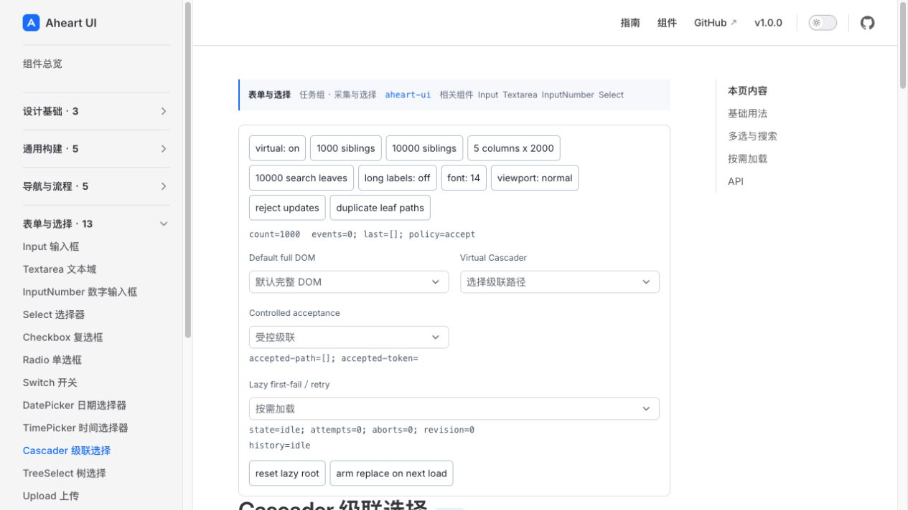

2. 1k 虚拟列打开 — 通过。

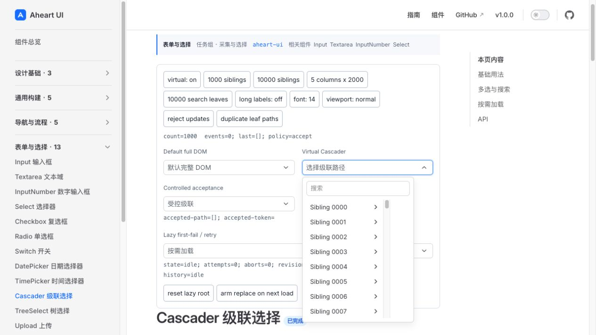

3. End 最后可用行 — 通过。

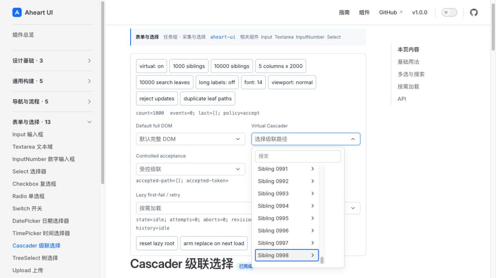

4. 10k 搜索尾项 — 通过。

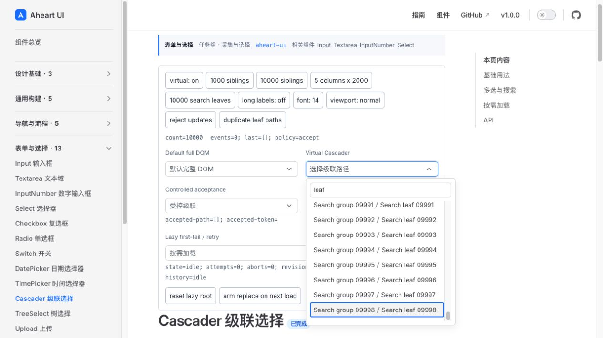

5. 空搜索 — 通过。

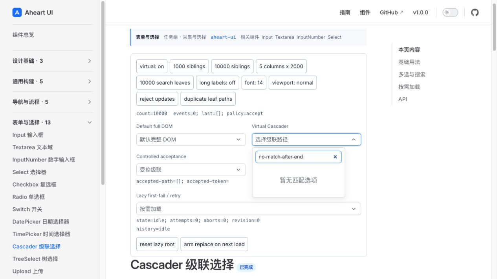

6. Lazy 错误保留焦点 — 通过。

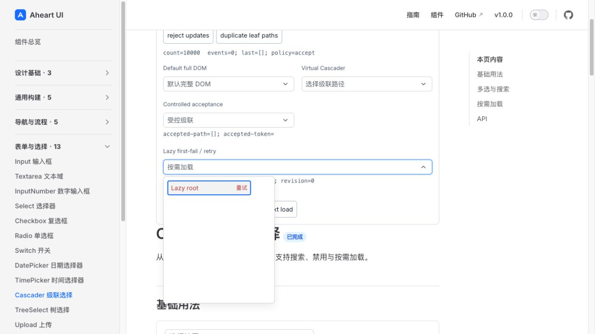

7. Enter 重试成功 — 通过。

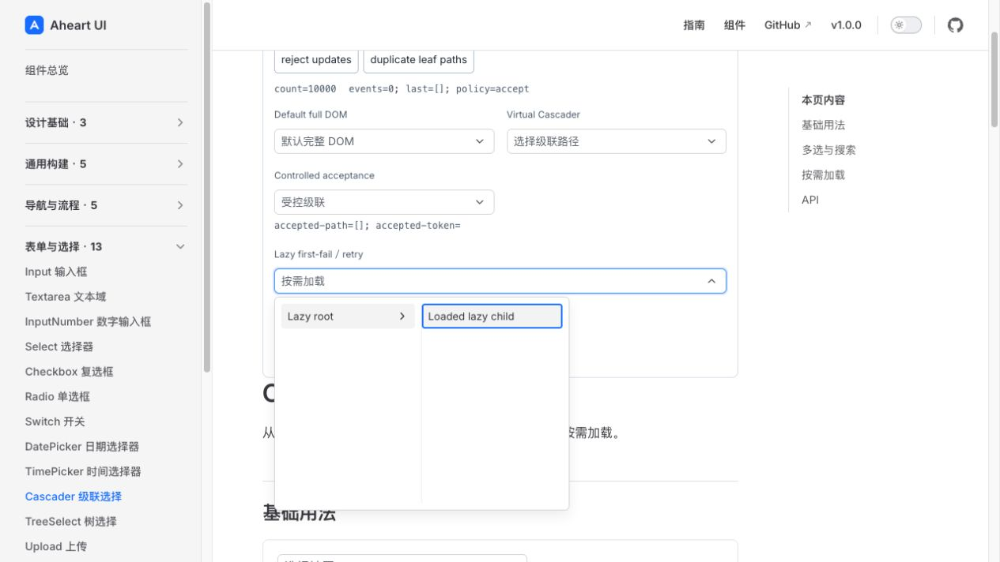

8. 受控拒绝 — 通过。

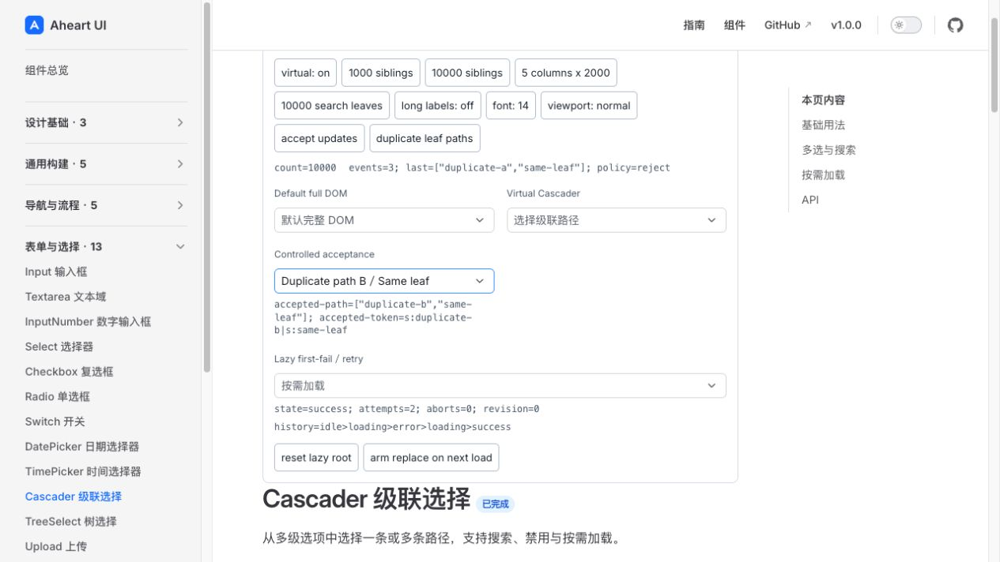

9. 深列焦点可见 — 通过。

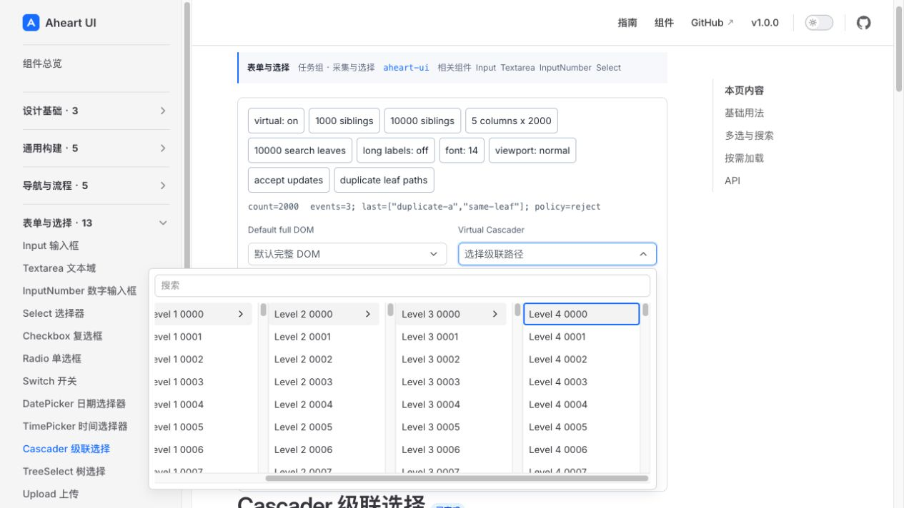

10. Left 返回完整根行 — 通过。

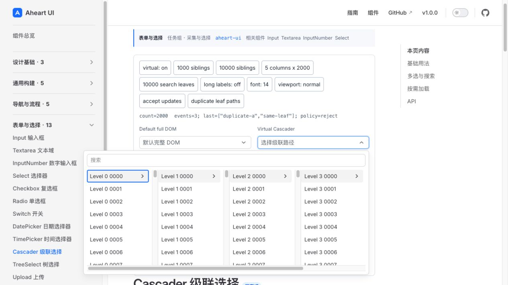

11. 24px 动态长标签 — 通过。

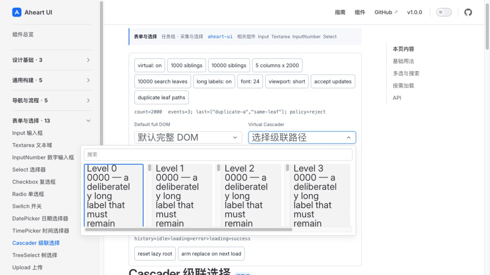

12. 超高行剩余内容可达 — 通过。

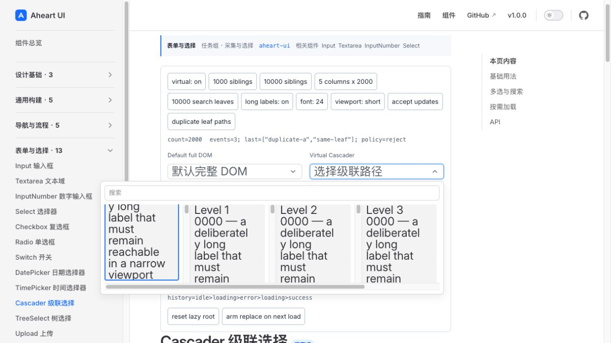

13. 选中背景与焦点环并存 — 通过。

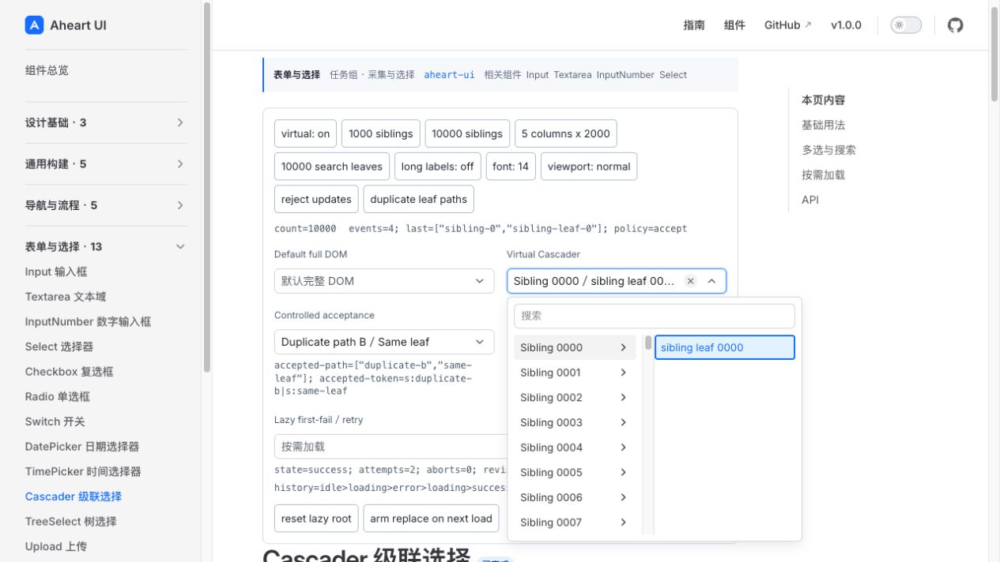
