# TreeSelect virtualization independent product acceptance

Verdict: **PASS for the TreeSelect functional substage, P0/P1/P2 = `0/0/0`. Cascader genuine RED is released.** This is a component-level product gate under the approved sequential workflow, not completion of the combined Tree/TreeSelect/Cascader phase or a release/deployment verdict.

Production candidate: `ad18e3b089a7f9ab0b1de35f2c09ea3395d01c28`. Reviewed HEAD: `586dfacfe1942b91523d769256c63bdd6f97afa1`. The latter changes only retry-test wrapper tracking and idempotent unmount; no production behavior or behavior assertion changed.

## Independent review method and candidate integrity

The product reviewer independently read the [approved architecture](../specs/2026-09-10-d4-deferred-virtualization-architecture.md), [architecture review](2026-09-10-d4-deferred-virtualization-architecture-review.md), [RED record](2026-09-10-d4-treeselect-virtual-red.md), [implementation and repair history](2026-09-10-d4-treeselect-implementation-review.md), [design review](2026-09-10-d4-treeselect-design-review.md), [test-manager review](2026-09-11-d4-treeselect-test-manager-review.md), relevant current source/assertions, final functional logs and original failure records. Product Design's screenshot-audit method informed the review. All 13 explicitly supplied final PNGs were individually opened with `view_image` at original detail; the design report alone was not accepted as visual proof.

This review did not operate the browser, preview port, build, generated output or existing repository files. The supplied final captures and frozen browser logs are being independently reviewed; they are not described as a new product-review browser run.

All 36 source/helper/fixture/E2E hashes in `/tmp/d4-ad18-final-DkTQXH/hash-after.sha256` and both configuration hashes match the current files. Its source, configuration and status before/after diffs are empty. Current source and the cleaned retry test also match `/tmp/d4-retry-cleanup-final-7riwkp/hash-after.sha256`; that run's production-hash diff is empty. The `ad18e3b..586dfac` diff contains only the one test file. Existing modified reports, evidence and distribution CSS were preserved and are not fresh release-output evidence.

## Product task matrix

| User outcome | Accepted evidence and result |
| --- | --- |
| Existing consumers retain default behavior; virtualization is deliberate | Current normalizer returns disabled for omitted/false, enables true/empty config, and uses TreeSelect defaults 256/28/4. Maintained core tests retain full DOM by default, bounded explicit modes, custom height, individual invalid-field fallback and caller immutability; public-barrel type check passes. No item-count auto-enable was introduced. |
| Large trees remain usable | The maintained five-browser 1k/10k case requires at most 24 mounted treeitems in both data sizes. Actual 10k search ArrowDown then End reaches enabled `node-09998`, skips disabled `node-09999`, keeps a bounded window and omits virtual trigger `aria-activedescendant`. Screenshot 04 is the 1k endpoint `Node 00998`; it is not relabelled as a 10k screenshot. |
| Search remains available while results scroll | Source wiring separates fixed search from the sole Tree scroll owner. Five-browser geometry tests measure exactly one vertical scroller, owner-realm stabilization, nonblank mounted windows, viewport bounds and accessible search/tail in short viewports. Screenshot 02 shows the search/tree relationship; screenshot 03 shows editable no-result state. |
| Checked selections survive windowing/search | Core checks operate against the full index, including descendants outside the filtered window and disabled boundaries. Screenshots 01–04 show two explicit tags, `+1` for the third selection, the corresponding checked rows, and unchanged tags through empty/tail search. |
| Controlled parent decisions remain authoritative | Core tests cover rejected controlled open/value; browser refusal assertions and screenshot 05 retain Node 00001 after requesting Node 00002. Screenshot 06 separately shows acceptance of Node 00002 after the parent policy changes. The independent multiple field stays unchanged. |
| Long content remains readable on a narrow screen | Screenshot 07 shows the complete Node 00010 long label wrapping within the popup at 24px, with search above it. Five-browser dynamic geometry checks verify measured 24px text, row content within rows, no row overlap, bounded windows and viewport budgeting. This is responsive/font evidence, not native 200% zoom. |
| Lazy failure provides an actionable recovery path | Screenshots 08–09 show loading followed by a contextual error and visible retry. Browser tests require `aria-busy`, the named button `重试加载 Lazy loading root`, Enter retry, loaded child and real root focus. Retry remains available in the selected collapsed error state (10). |
| Retry works after selection, close and reopen | Screenshots 10–12 show selected/collapsed error, retry loading and expanded success. In all five project logs the result is `state=success; attempts=2; aborts=0`, `expanded=true`, `activeKey=lazy-root`. The visible retry was not hidden/disabled to bypass this path. |
| Keyboard continuation works after retry removes its button | Maintained browser assertions require actual root focus, ArrowRight child focus and child selection. Screenshot 13 shows the accepted child value and closed popup; the supplied manual design run records Enter selection. The automated browser cases select the child by click after verifying ArrowRight focus, so they are not described as automated Enter-selection coverage. |
| Default-theme error and selected text remain readable | Screenshots 09–12 show legible error/selected text. Final computed browser ratios are approximately normal retry 5.3056, hover retry 5.0831, selected retry 4.7368 and selected title 4.9447, each passing the retained 4.5 test threshold. This applies to the tested default theme, not arbitrary token overrides or full accessibility compliance. |
| Lifecycle repairs do not steal focus or leave active retry ownership | Maintained tests and the independent 24-case review cover explicit blur/outside focus, accepted versus rejected close/expansion, node removal, disable/unmount, old versus newer navigation, terminal listener retirement and nonvirtual/fallback paths. Test-manager cleanup review closes the formerly untracked TreeSelect wrapper without weakening expectations. |

## Final evidence read directly

| Evidence location | Result checked |
| --- | --- |
| `/tmp/d4-ad18-final-DkTQXH/unit/lazy10-retry20.log` | 30/30; exit 0 |
| `/tmp/d4-ad18-final-DkTQXH/unit/all-maintenance.log` | 142/142 across 14 files; exit 0 |
| `/tmp/d4-ad18-final-DkTQXH/unit/public-type.log` and `.exit` | Public types; exit 0 |
| `/tmp/d4-ad18-final-DkTQXH/browser/tree-select-50.log` | 50/50 across desktop/mobile Chromium, Firefox, desktop/mobile WebKit; exit 0 |
| `/tmp/d4-ad18-final-DkTQXH/browser/tree-45.log` | Shared Tree regression 45/45 across the same five projects; exit 0 |
| `/tmp/d4-tree-retry-ad18e3b.KQ2pR1/review.md` and `ownership-24.log` | Independent development P0/P1/P2 0/0/0; 24/24 diagnostics |
| `/tmp/d4-retry-cleanup-final-7riwkp/` | Cleaned retry20 20/20, lazy10 10/10, maintenance142 142/142, public types exit 0 |

The browser suite installs console-error and page-error capture before navigation and asserts empty captured arrays after each case. Current passing results retain those checks; no new skip is claimed. These scoped suites do not stand in for full-repository E2E/QG5.

## Screenshot-by-screenshot product inspection

1. Closed tags — PASS. Two named selections and a `+1` overflow count are visible; clear and expand controls are distinct.

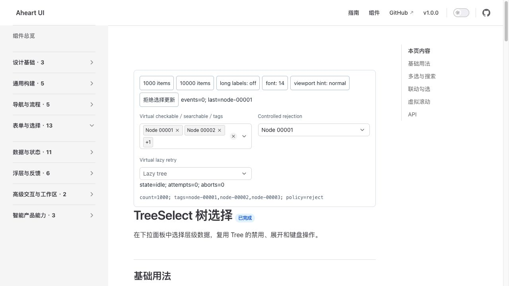

2. Open searchable tree — PASS. The search field sits above the scrollable rows; the three checked selections match the tags.

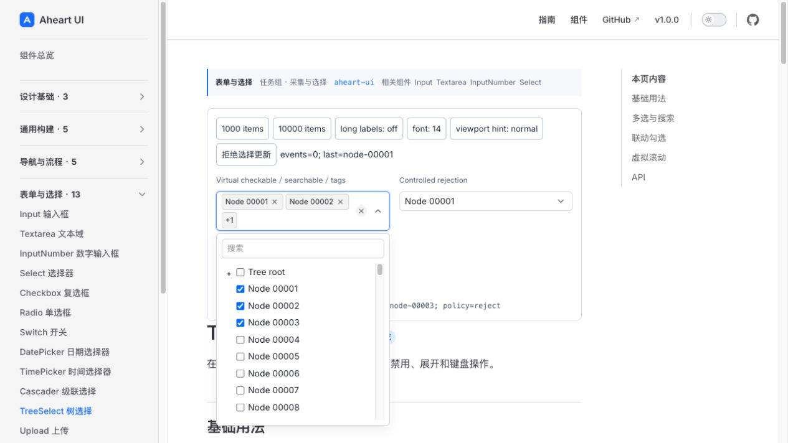

3. Empty search — PASS. The explicit empty message preserves an editable query and the accepted tags.

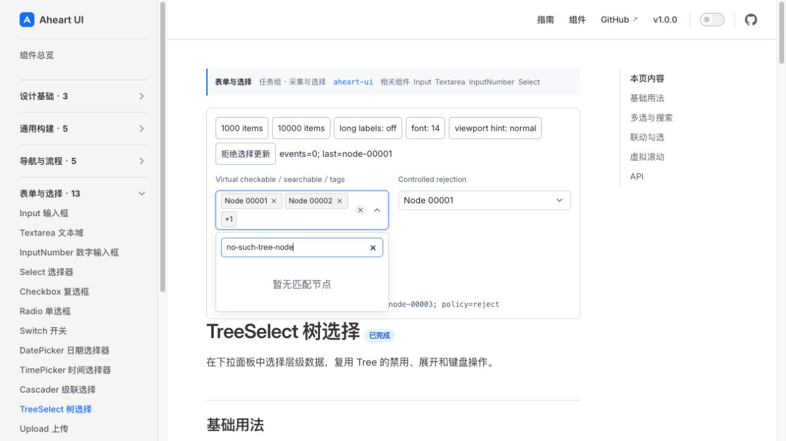

4. Keyboard search tail — PASS. Node 00998 is fully visible at the 1k tail. Actual keyboard focus and the 10k endpoint are established by the maintained assertions/logs.

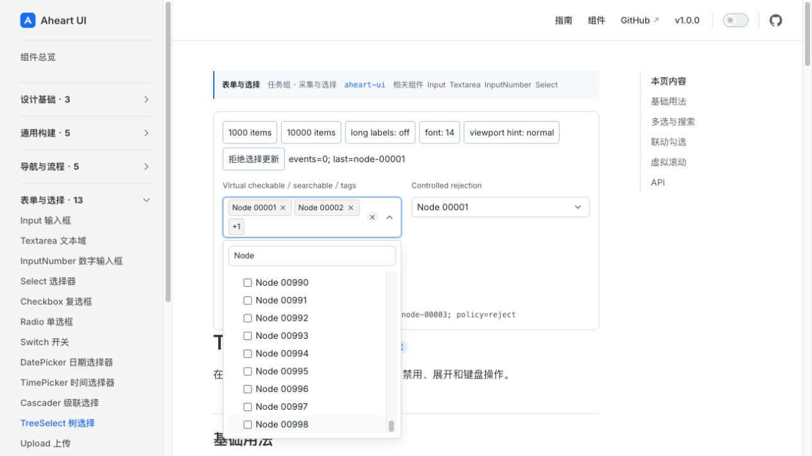

5. Controlled refusal — PASS. The readout requests Node 00002 while the controlled field remains Node 00001.

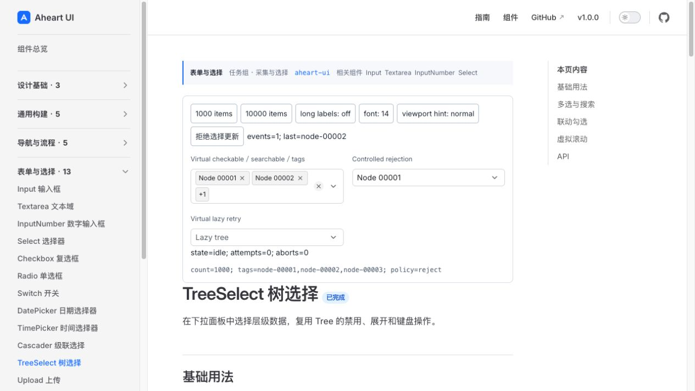

6. Controlled acceptance — PASS. The changed parent policy accepts Node 00002; the multiple selection is unchanged.

7. Narrow 24px long label — PASS. The full sentence wraps visibly within the popup and the search control remains reachable above it.

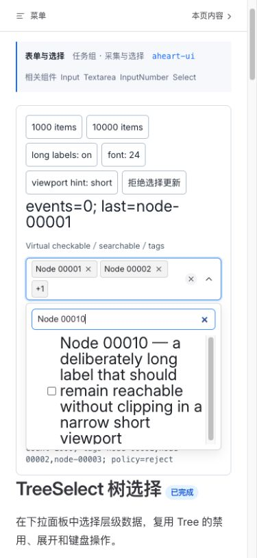

8. Initial lazy loading — PASS. Loading is expressed on the root row and preserves the trigger's current value.

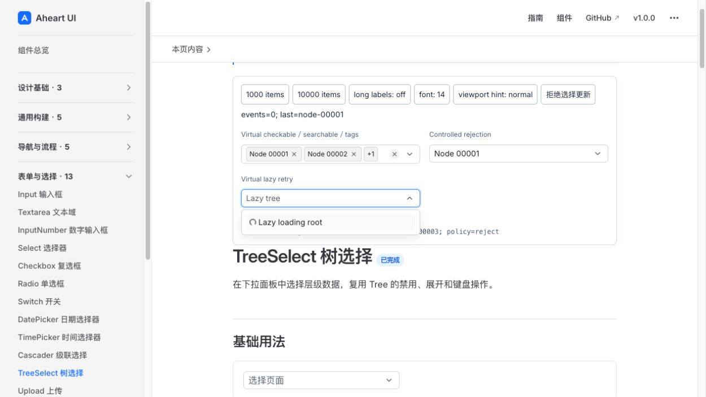

9. Lazy error — PASS. Failure and retry remain beside the root context, with visibly distinct text.

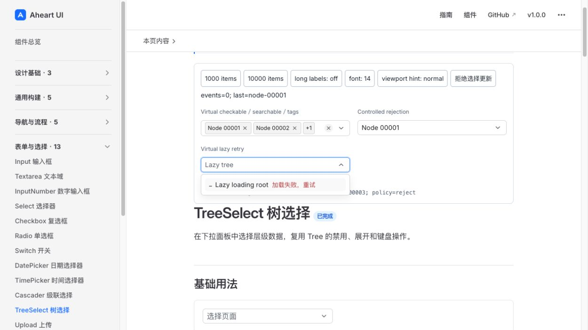

10. Selected collapsed error — PASS. The trigger and row agree on the selected root; the collapsed affordance and visible retry are retained.

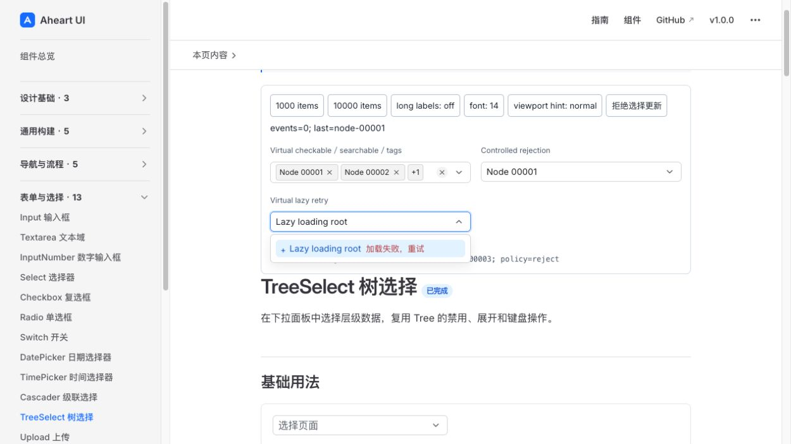

11. Collapsed retry loading — PASS. Retry visibly transitions the selected root into loading; exact load/abort counts are verified in the functional evidence.

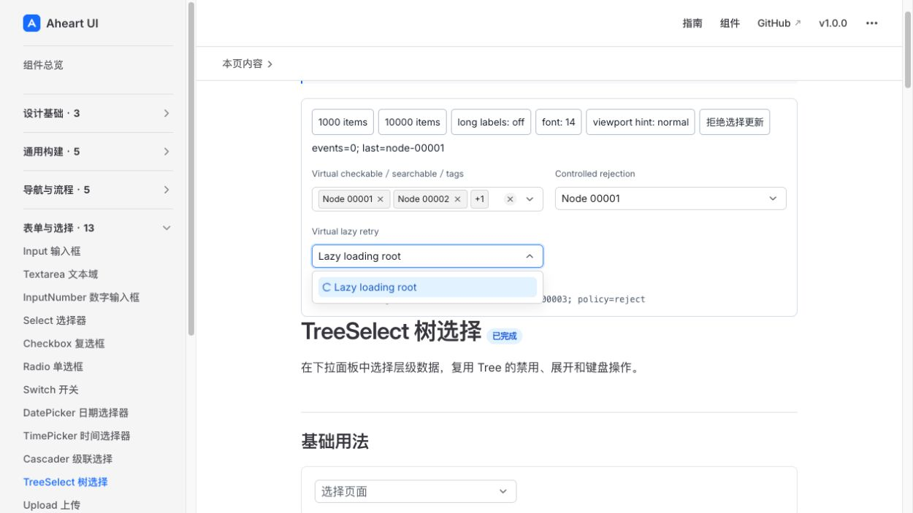

12. Retry success/root handoff — PASS. The expanded root and loaded child are both visible. Root focus is proven by actual-focus assertions and logged active key, rather than inferred only from selected color.

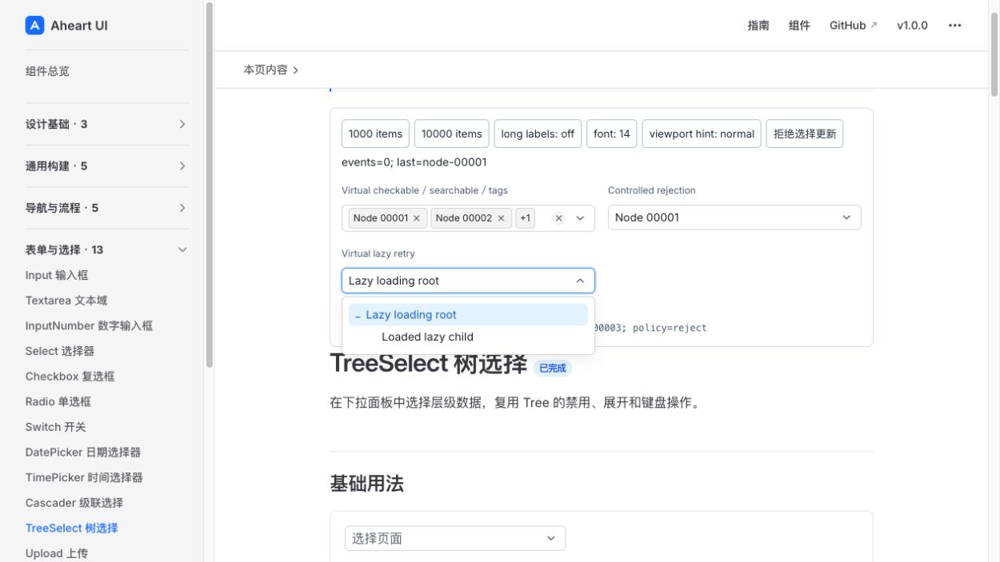

13. Loaded child selected — PASS. The popup closes with `Loaded lazy child` in the trigger; the visible state readout is success, two attempts, zero aborts.

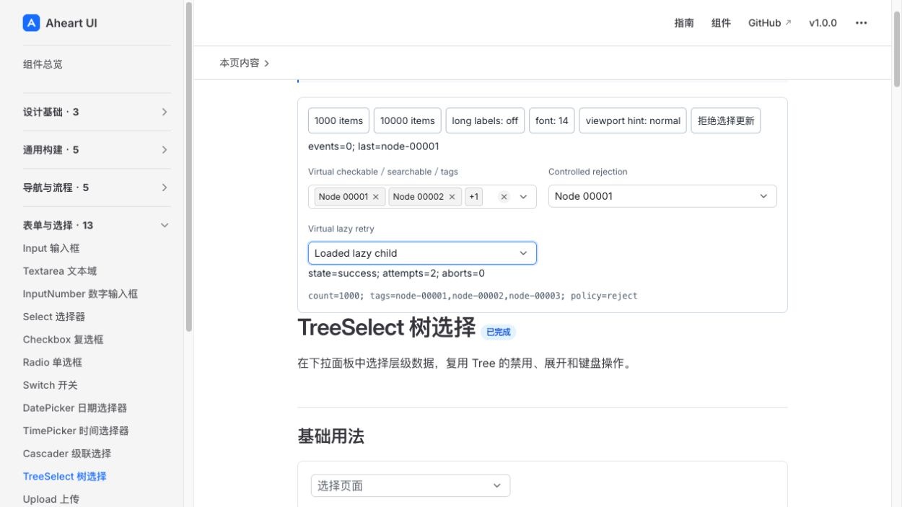

## Failure closure and scope preservation

The core RED preceded implementation, including public-type and genuine browser failures. Existing controlled/checkable compatibility was not fabricated as RED. The Teleport-stub remount failure was withdrawn after the real-Teleport comparison; dead preview, external icon CORS and intermediate test-transform failures are not counted as component repairs or passing evidence.

The implementation history retains the six initial development findings and the four remaining second-round causes, then `effc110` independent closure. Later real-popup root-focus failure was repaired at `91f212b`; default-theme contrast RED was repaired at `6ecf8cb`. The collapsed retry RED at `66dc6ac` is independently visible in the original five-failure log (`state=aborted; attempts=2; aborts=1`). The subsequent lifecycle RED has four failures/14 cases, listener RED two failures/18 cases, and ownership RED two failures/24 cases in their preserved logs. Repairs `53fdd5d`, `c759ed4` and `ab5b9f0` remained rejected until `ad18e3b` closed exact ownership with the maintained expectations intact.

The test-manager's later P2 wrapper-cleanup issue is closed by `586dfac`, whose diff changes tracking/unmount only. This product PASS follows that closure. Neither visible retry behavior, real-focus requirements, the contrast threshold nor the approved combined phase gates were removed to obtain the verdict.

## Boundaries and next gate

Native browser 200% zoom, actual browser iframe Teleport, real tgz ESM/CJS/CSS/declarations/SSR/hydration and application SPA cleanup remain joint consumer gates. Attached jsdom hydration and iframe-owner lifecycle units are useful functional evidence but are not substituted for those consumer runs.

Cascader implementation and acceptance remain outstanding. After its own RED/GREEN and role gates, one frozen three-component candidate must run the approved fixed/coarse/dynamic 1k/5k/10k performance protocol, first-interaction medians, per-offset scrolling, long tasks/CLS and combined gzip delta at most 12KiB. This review does not claim those metrics have passed.

The same final combined candidate still requires full-repository unit/typecheck, deterministic double build, generated-output check, docs build, release pack, complete E2E/five-browser QG5 and final role/product review, then exact-head PR CI, merge, master CI, Pages and live deployed interaction. Earlier full-repository/release runs on different source are not current-candidate proof.

There are no remaining P0/P1/P2 findings within the reviewed TreeSelect functional substage. The approved sequential workflow may now start Cascader genuine RED; it does not authorize a combined-phase-complete, merged, published or deployed claim.
